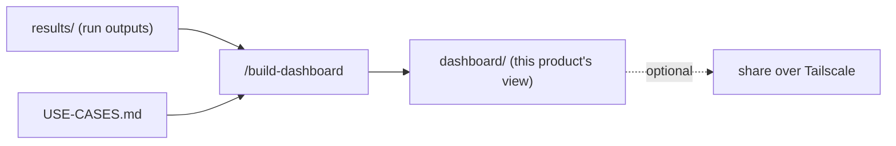

# Build the dashboard (bespoke)

Build a results view tailored to **this product's use cases** in `dashboard/`. Like BLG mission control — there's no shared dashboard to conform to. Pick the simplest thing that shows what matters: a static HTML page over `results/`, a small Flask/FastAPI app, a Streamlit board — whatever the engineer prefers.



## Read first
`USE-CASES.md` (what to surface), the `tests/<use-case>/plan.md` files (pass/fail criteria), and a sample of `results/` (the run output shape your plans write).

## Build `dashboard/`
Show, per use case: latest pass/fail, the key measurements (e.g. sleep current vs ceiling, time-to-fix, cloud check-in latency), trend across runs, and links to the run artifacts. Decide the format with the engineer; keep it readable and easy to run (document the run command in `dashboard/README.md`). Read from `results/`; don't duplicate raw data.

## Make it a command center (encouraged)
Don't stop at a read-only view — make the dashboard the place you **drive** testing from, like BLG mission control. Add **buttons to launch specific tests** (e.g. "Test IO", "Sleep current", "Full run", "Flash variant B") so the engineer picks what to test and what to skip from one surface, and sees pass/fail come back live. Wire the buttons however fits this product:
- **Direct**: the button runs the test plan's script (the dashboard app shells out to `tests/<use-case>/`).
- **Claude-in-the-loop**: the button drops a request (a file/queue entry) that a watching Claude session picks up and executes — useful when a run needs judgement or setup. Build the watcher as a small loop in this repo.

Keep it flexible: this is *this product's* control center, so its buttons map to *this board's* tests. Add buttons as new tests appear.

If they want it reachable off the bench, expose it over Tailscale (the machine has it):
```powershell
tailscale serve --bg --https=443 http://127.0.0.1:<port>
tailscale funnel --bg 443 on
```

## Update
Note the dashboard in `PROJECT-STATUS.md` (Phase 6); point "next" at `/run-test`.

## Guardrails
- Read-only over `results/`; don't change test data to make the dashboard look good.
- Keep it product-specific — it's fine (expected) that every product's dashboard is different.
