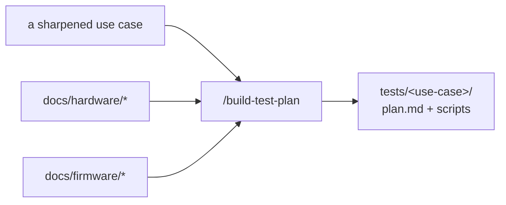

# Build a test plan (bespoke, per use case)

For a chosen use case from `USE-CASES.md`, build everything needed to validate it on this board, in `tests/<use-case>/`. Use the *raw tools the machine has* (installed by vx-station-setup) — there's no framework to fit into. Ground every step in the understand-docs so it works on the real hardware, not just in theory.

## Read first
The target use case in `USE-CASES.md`, the relevant `docs/hardware|firmware|software/*.md`, and `.claude/memory/`. These give the exact signals, limits, build/flash details, and gotchas.

## Build `tests/<use-case>/`
1. **`plan.md`** — purpose, the exact steps, the observable signal(s), pass/fail criteria, and preconditions/caveats (carry the false-fail traps from `.claude/memory/`). Include a Mermaid diagram. This is the human-readable contract.
2. **Scripts** — the actual test, using what fits:
   - **Flash**: J-Link via `pylink`, or `nrfutil device program` (from the firmware doc's build/flash details; `nrfjprog` too if you've installed it separately). Confirm the firmware image is real before relying on it.
   - **Observe**: `pyserial` for UART, `pylink` for RTT, matching the **exact** signatures from the firmware doc (mind serial-vs-RTT — the firmware doc says which).
   - **Measure**: the `ppk2-api` lib for current/power, against the use case's limits.
   - **Cloud**: query the software's API / ThingsBoard for the DUT (use `secrets/device_map.yaml`), per the software doc.
   - **Judge**: compute pass/fail from the criteria; write a small result (e.g. `results/<run>/summary.json` or `.md`).
   Keep scripts readable and self-contained; a test repo can `pip install` anything extra it needs.

Build the highest-priority use cases first. Don't force a shared structure across plans — each is bespoke; consistency is nice-to-have, not required.

**Separate by scope, not just by use case.** The same board often needs a quick "IO only" check, a "sleep current only" measurement, and a "full run" — make those separate, independently runnable plans so the engineer (or the dashboard) can pick exactly what to test and what to skip. The same firmware with different settings, or a different variant image, is just another plan.

**Add a command for anything run often.** Drop a `.claude/commands/<verb>.md` in this repo (e.g. `/test-io`, `/test-sleep-current`, `/test-all`, `/flash-variant`) that runs the matching plan directly — fast verbs for this board. The dashboard's mission-control buttons can call the same plans.

## Update
Mark Phase 5 progress in `PROJECT-STATUS.md` (list the plans built); point "next" at `/build-dashboard` (or `/run-test` to try a plan now).

## Guardrails
- Match the real signals/limits from the docs; encode the gotchas so tests don't false-fail.
- The board's firmware/hardware repos are read-only — a test never modifies them.
- A plan that can't be made deterministic should say so in its `plan.md`.
