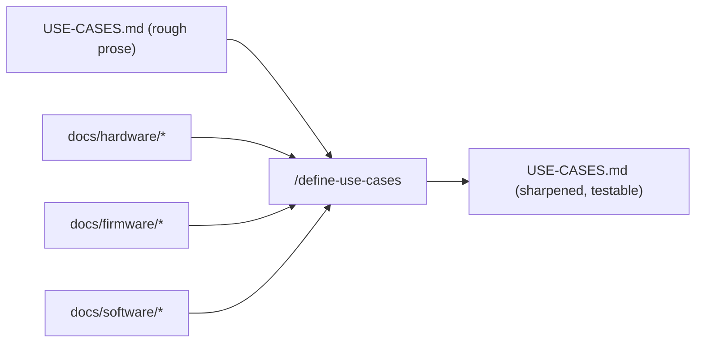

# Define the use cases (make them testable)

Turn the rough use cases captured at scaffolding into **clear, testable scenarios** — still prose, but each with concrete pass/fail criteria grounded in what the understand-skills learned. This is what `/build-test-plan` turns into actual tests, so precision here pays off.

## Read first
`USE-CASES.md` and every `docs/hardware|firmware|software/*.md` and `.claude/memory/`. If the understand-docs are missing, run those skills first — defining testable criteria without them is guesswork.

## What to do — with the engineer
For each use case, sharpen it into:
- **Scenario** — the situation + steps, in plain language.
- **Observable signal** — the *exact* thing a test will watch, pulled from the docs: a specific RTT/serial line, a measured current, a cloud telemetry key, a GPIO state, a time-to-event.
- **Pass/fail criteria** — concrete numbers/strings (sleep current ≤ X µA; boot banner within N s; uplink within N min). Pull limits from the use case + docs; **ask the engineer** when a number is unknown — don't invent it.
- **Preconditions / caveats** — anything that would false-fail it (debugger attached inflating current; a bench bypass flag; supercap still forming). Lift these from `.claude/memory/` and the firmware doc.
- **Priority** — so `/build-test-plan` knows what to build first.

Keep it prose and readable (a tester should understand it), but leave no ambiguity about what "pass" means. Note which hardware/firmware/software the use case exercises (helps issue routing later).

## Update
Rewrite `USE-CASES.md` with the sharpened scenarios (keep a Mermaid diagram). Mark Phase 4 done in `PROJECT-STATUS.md`; point "next" at `/build-test-plan`.

## Guardrails
- Don't invent pass/fail numbers — derive from use cases/docs, or ask.
- Keep the source repos untouched (read-only).
