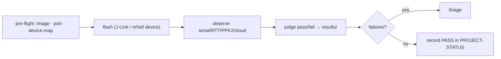

# Run a test (flash + observe + judge)

Execute a bespoke test plan against a DUT and turn the outcome into a clear pass/fail. This runs the plan's **own** scripts (built by `/build-test-plan`) — there's no shared runner.

## Phase 0 — Pre-flight
Confirm with the engineer: which **use case / test plan** (`tests/<use-case>/`), the **DUT serial**, and that the bench is ready. A run **flashes the DUT** — confirm the unit + firmware image first. Check:
- the **firmware image exists** (per the plan / firmware doc) — drop the `.hex` or fetch the release; `firmware/` is gitignored.
- the **serial port** / probe is connected and known.
- if the plan checks **cloud**, ensure `secrets/device_map.yaml` exists (copy `secrets/device_map.example.yaml` to it if not — it carries the `/new-test` interview's DUT→device example) and is filled for this DUT.

## Phase 1 — Run the plan
Run the plan's scripts: flash → observe (match the exact signatures / take the measurements the plan specifies) → judge pass/fail from its criteria. Honor the caveats in the plan + `.claude/memory/` (e.g. detach the debugger before a sleep-current read; respect a bench bypass flag) so a healthy unit doesn't false-fail. Over-current or unsafe conditions → stop and power down.

## Phase 2 — Record
Write the run to `results/<run>/`: a small `summary.md`/`summary.json` (overall + per-criterion pass/fail with the measured values) plus the raw captures (serial log, power profile) — raw is gitignored, the summary is kept. **Quote the key evidence** (the matched/unmatched signature, measurement vs limit) in the summary, since the raw captures won't be in git.

## Phase 3 — Route failures
If anything failed (or a surprising pass deserves a record), run **`/triage`** for this run. Don't hand-file issues here — triage classifies, routes to the right repo, dedups, and mirrors locally.

## Phase 4 — Status
Append the run to `PROJECT-STATUS.md` (use case, outcome). The dashboard (`/build-dashboard`) reads from `results/`.

## Guardrails
- A real run flashes the DUT — confirm the unit + image first.
- Never modify the hardware/firmware/software repos (read-only). Findings → issues.
- Report failures faithfully with the evidence; don't suppress them.
