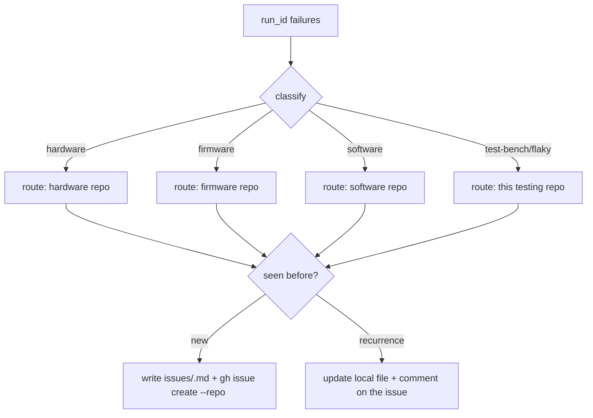

# Triage failures into routed issues

Each real failure becomes **one GitHub issue on the repo it belongs to**, plus a durable local mirror in `issues/`. Re-runs update the existing issue instead of filing duplicates.



## ⛔ Note on the hard stop
You may **open issues on** the hardware/firmware repos — that's reporting, not editing. You must still **never** push code, branches, or PRs to them. Confirm with the engineer before creating GitHub issues (outward-facing); show the proposed list first.

## Phase 1 — Gather + classify + route
Read the run's failures from `results/<run>/` (and the evidence the test plan recorded: serial/RTT lines, measurements, artifacts). For each finding, classify **and** pick the destination repo:
- **hardware** — a board defect (rail wrong, component dead, test point absent) → the relevant **hardware repo** (a `hardware:` entry in `project.yaml`).
- **firmware** — wrong/missing log, bad behaviour, regression → the relevant **firmware repo** (a `firmware:` entry).
- **software** — cloud/backend/app/API defect (telemetry not landing, wrong rule-chain/transform, dashboard/API bug — *not* the firmware's fault) → the relevant **software repo** (a `software:` entry).
- **test/bench** — the test plan, a limit, or the bench is wrong (bad threshold, flaky matcher, miswired fixture) → **this** testing repo.
- **flaky** — non-deterministic; record but consider a few re-runs before filing.

**Each domain routes to its own repo** — hardware→hardware, firmware→firmware, software→software, test/bench→here. Resolve the exact repo by the `name` in `project.yaml` the failure pertains to: the test plan (`tests/<use-case>/plan.md`) notes which hardware/firmware/software it exercises, and `docs/hardware|firmware|software/*` help you pin it. If a failure can't be attributed to one entry (e.g. a missing boot banner that could be app *or* bootloader), default to the **primary/app** entry, and say so in the issue's "Suspected area" (or ask the engineer).

## Phase 2 — Dedup by signature
Compute a **stable** signature `<use-case>|<check>|<failure-fingerprint>` and check `issues/` for an existing file with it.

The **fingerprint is the failure CLASS, never the measured value** — otherwise a metric that drifts each run files a new issue every time. Use the qualitative reason only, e.g. `signature-not-seen` · `over-ceiling` · `under-floor` · `over-current` · `timeout` · `flash-failed`. **Never** put the run id, a timestamp, or the exact number in the signature — those go in **Evidence**.
- A sleep-current fail measuring `47.2µA / 15µA` this run and `52.0µA` next run → both fingerprint `over-ceiling` → **same** signature `sleep-current|sleep_current|over-ceiling` → one issue, updated.
- A missing boot banner → fingerprint `signature-not-seen` → `cold-boot|boot|signature-not-seen`.

Then:
- **Recurrence** (signature already in `issues/`) → append this `run_id` to `seen_runs`, update `last_seen_run`, and add a short comment to the GitHub issue ("seen again in `<run_id>`: <new measurement>"). Do **not** open a new issue.
- **New** → continue.

## Phase 3 — File it (local + GitHub, routed)
Write `issues/<id>.md` per the format in `issues/README.md` (frontmatter + Summary/Expected-vs-Actual/Evidence/Repro/Suspected-area). **Quote the key evidence lines** (the matched/unmatched signature, the measurement vs limit) directly into the body — the raw `rtt/`, `serial.log`, and `power/` captures are gitignored (local-only), so an issue can't rely on the committed run dir containing them. Then file on the routed repo:
```powershell
gh issue create --repo Viaanix/<routed-repo> --title "<title>" --body-file <tmp-body> --label vx-test
```
Put the returned issue number in the local file's `github:` field. If `gh issue create` fails (no rights on that repo), set `github: "unfiled (no gh perms on <repo>)"`, keep the local issue, and tell the engineer which issues need filing by someone with access.

## Phase 4 — Status
Note the filed/updated issues in `PROJECT-STATUS.md` under the run. Commit **only** the issue mirror + status — `git add issues/ PROJECT-STATUS.md` — never `git add -A`, and never stage `.refs/` (the read-only source clones).

## Guardrails
- Route to the **respective** repo; default to this testing repo only for harness problems.
- One issue per distinct failure signature; dedup, don't duplicate.
- Confirm before creating GitHub issues; never push code to hardware/firmware repos.
- Every issue links the run + artifacts so it's reproducible.
