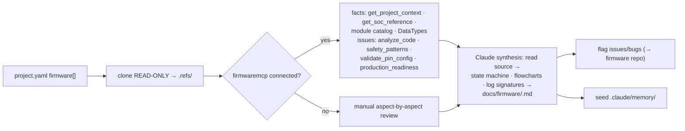

# Understand the firmware (full depth)

Produce, for **each** firmware repo in `project.yaml`, a `docs/firmware/<name>.md` that tells a test exactly what to expect and match on, and **flags the issues/bugs it finds**. This is a **testing reference + audit** — you never write or change firmware.

This skill is **powered by the `firmwaremcp` MCP server** (Dyad-Apps/firmwaremcp) when its tools are available — it supplies the structured facts (SoC specs, the Viaanix SDK module catalog, the 113 DataTypes, code/safety/pin/readiness analysis). **firmwaremcp does NOT build call-graphs, state machines, or log-string dictionaries — Claude synthesizes those** from the source. If the MCP isn't connected, do the manual review (Phase 1-alt).



## ⛔ Hard stop — READ-ONLY, never write firmware
Clone shallow + read-only into `.refs/<name>/` with the remote removed (Phase 0). Read it; write only into THIS test repo. **Never** modify, commit, push, branch, or PR the firmware repo, and never author/edit firmware anywhere. Bugs you find → **issues** on the firmware repo, never code changes.

## Phase 0 — Get the sources (read-only)
```powershell
git clone --depth 1 --no-tags <repo> .refs/<name>
git -C .refs/<name> fetch --depth 1 --no-tags origin <ref>; git -C .refs/<name> checkout --detach FETCH_HEAD
git -C .refs/<name> remote remove origin
```
Record the reviewed commit. Never `git add` `.refs/`.

## Phase 1 — Full-depth review via firmwaremcp (preferred)
Point the MCP tools at `.refs/<name>/`. Gather **facts**, then **issues**:

**Facts (build the picture):**
1. `get_project_context(project_dir)` → SoC, NCS version, modules, connectivity, app_type, BLE role, board, **critical Kconfig**, required DTS aliases, hardware TODOs.
2. `get_soc_reference(soc)` → pinout, peripherals, memory layout, power specs, pin-sharing constraints.
3. `get_module_catalog(product)` + `get_board_pin_config(board)` → SDK modules (Kconfig, deps) and the board's I2C/SPI/UART/GPIO device map.
4. `lookup_data_type(...)` / `decode_data_type(...)` → the **DataTypes this product uplinks** (IDs, fields, formulas) — essential for cloud check-in tests.

**Issues (audit — flag everything):**
5. `analyze_code(paths, checks="all")` → banned APIs, naming/structure violations, TODOs.
6. `check_coding_standards(files)` + `check_safety_patterns(files)` → safety anti-patterns **C01–C12** (ISR work, single-sample sensor reads, raw NVM writes, watchdog-in-error, K_FOREVER on hw semaphores, GPIO pull leaks…).
7. `validate_pin_config(overlay_path)` → pin conflicts, sharing violations, floating pins.
8. `check_production_readiness(gates="all")` → 10 gates (secure boot, OTA, logging, power/brownout, certs, static analysis, binary size, versioning, regulatory) → **blockers**.
9. `scan_todos(...)` + `analyze_migration(project_root)` → dev-state TODOs and legacy/deprecated-pattern debt.

## Phase 1-alt — Manual review (fallback, if firmwaremcp not connected)
Cover every aspect below by reading the real source and citing files — sequentially, or parallelized with a fan-out workflow (agent per aspect → synthesize → adversarial critic). Depth + citations mandatory.

## Phase 2 — Synthesize `docs/firmware/<name>.md` (Claude does the diagrams)
firmwaremcp gives facts; **you build the understanding**. Read the source (esp. `main.c`, the state machine, init, logging, comms) and write the doc with these sections + **Mermaid diagrams** (the user wants logic diagrams/flowcharts):
- **Identity & variants** — app, build system, targets, settings differences.
- **Boot & lifecycle** — **Mermaid state machine** of reset→app states + transitions; the **exact boot banner string**; init order; fault/assert handling.
- **Observability** — RTT control-block addr + channels, serial config, and the **exact log strings/regexes a test matches** (boot, ready, errors, uplink) — *you extract these by grepping `LOG_*`/`printk`/RTT calls in the source; the MCP won't*.
- **Comms** — radios/protocols, **uplink schedule + payload format** (cross-referenced to the DataTypes from step 4), bench bypass flags; **Mermaid connectivity flowchart** (init → advertise/join → TX/RX → store → sleep).
- **Provisioning** — keys/UUID/factory data, commissioning, and any secret-at-boot leak risk.
- **Power behaviour** — sleep modes, expected current per mode, debug-build pitfalls (logging on → high floor), debugger-attached effects.
- **Build-time config** — prod vs debug, bench toggles; how to build a prod and a test image.
- **Module/architecture** — **Mermaid module-dependency graph** (from the module catalog's `depends_on`).
- **Known issues / test hooks** — the flagged issues from Phase 1 + console/shell commands a test can drive.
- **Sources & gaps** — files + reviewed SHA + honest unknowns.

## Phase 3 — Flag issues + seed memory + status
- **Flag issues/bugs** from Phase 1 (safety anti-patterns, readiness blockers, pin conflicts, migration debt) — route to the **firmware repo** (via `/triage`'s routing). Severity-tag them. Never push code.
- **Seed memory** — the exact match signatures, prod-vs-debug markers, bench bypass flags, sleep-current expectations + debug-build pitfalls, provisioning/secret cautions.
- Mark Phase 2 done in `PROJECT-STATUS.md`; point "next" at `/understand-software` (or `/define-use-cases` if no software repos).

## Guardrails
- READ-ONLY on firmware repos; never write firmware (hard stop). Never `git add` `.refs/`.
- Cite sources; record the reviewed SHA; gaps over guesses.
- firmwaremcp is regex-based (not AST) — treat its findings as leads, confirm against the source.
