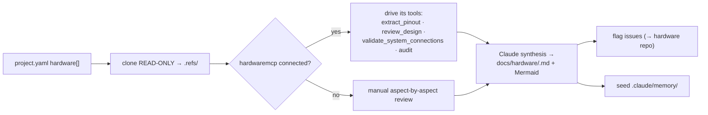

# Understand the hardware (full depth)

Produce, for **each** hardware repo in `project.yaml`, a `docs/hardware/<name>.md` a tester (and Claude) can rely on to know exactly what the board *is and is not*. This is the foundation everything downstream rests on — do it thoroughly.

This skill is **powered by the `hardwaremcp` MCP server** (Viaanix/hardwaremcp) when its tools are available — that's the full-depth path. If it isn't connected, do the **manual review** (Phase 1-alt). Either way, the read-only hard stop and the output rubric are the same.



## ⛔ Hard stop — READ-ONLY
Clone the hardware repo **shallow + read-only** into the gitignored `.refs/<name>/` and remove its remote (see Phase 0). The hardwaremcp tools only **read** it. **Never** modify, commit, push, branch, or PR the source repo. (hardwaremcp can also clone to its own `~/.viaanix-hw/` cache — that's read-only too; never write back. Filing GitHub **issues** on the repo is allowed; pushing code is not.)

## Phase 0 — Get the sources (read-only)
For each `hardware:` entry, clone shallow into `.refs/<name>/` and neuter the remote:
```powershell
git clone --depth 1 --no-tags <repo> .refs/<name>
git -C .refs/<name> fetch --depth 1 --no-tags origin <ref>; git -C .refs/<name> checkout --detach FETCH_HEAD
git -C .refs/<name> remote remove origin
```
Record the reviewed commit (`git -C .refs/<name> rev-parse HEAD`). Never `git add` `.refs/`.

**Check what's in the repo.** hardwaremcp parses Altium **exports**: a `.NET` WireList netlist, BOM `.xlsx`, Gerbers, pick-and-place, and a schematic/assembly **PDF** — usually under a `manufacturing/` package. It **cannot** parse raw binary `.SchDoc/.PcbDoc`. If the repo has only binary Altium files and no exports, **say so**: ask the engineer to export the manufacturing package (or run the Phase-2 live-Altium bridge), and proceed with whatever exports + PDFs exist + the manual review for the rest.

## Phase 1 — Full-depth review via hardwaremcp (preferred)
Drive the MCP tools against the cloned repo (point their `package_path`/`repo_path` at `.refs/<name>/`). A good sequence:
1. `get_board_info(board_id)` — SoC, layer count, RF interfaces, revision (board catalog).
2. `extract_pinout(mfg_package_path, board_id, board_rev, soc_refdes)` → the SoC pin map (net → function/peripheral) from the netlist.
3. `validate_pinout_config(soc, pinout)` and `validate_system_connections(board_id, rev, schematic_path)` → pin conflicts, floating nets, open-drains without pulls, differential-pair issues. **(issues to flag)**
4. `validate_manufacturing_package(package_path, board_id, layer_count)` → manufacturing audit (score + FAB findings). **(issues to flag)**
5. `review_design(mfg_package_path, board_id, board_rev)` → a structured review brief (files manifest, automated findings, rulepack checks, instructions) to guide the visual pass.
6. `review_pcb_layout(gerber_path, drill_path, layer_count)` → trace/clearance/via findings. **(issues to flag)**
7. Optionally `generate_hardware_spec` / `generate_firmware_handoff` / `generate_bringup_checklist` to get the MCP's own structured docs, then fold the useful parts into `docs/hardware/<name>.md`.
8. **Claude reads the schematic + assembly PDFs visually** (the MCP gives the file manifest + instructions; the engineering-judgement pass is yours) — power distribution, decoupling, reset/clocks, RF matching, connector pinouts, ESD.

## Phase 1-alt — Manual review (fallback, if hardwaremcp not connected)
Review the board **one aspect at a time** (the rubric below), reading the real files (READMEs, BOM CSV, netlist text, datasheets, schematic PDFs) and citing them. If your session supports orchestration, parallelize with a fan-out workflow (one agent per aspect → synthesize → adversarial critic); otherwise do it sequentially. Depth + citations are mandatory; binary CAD you can't parse is a declared gap, not a guess.

## Phase 2 — Write `docs/hardware/<name>.md` (the rubric)
Header: board name, **repo + reviewed commit SHA**. Then, in order: **Identity & role** · **Compute** (MCU part, cores, memory) · **Power architecture** (rails + regulators, energy storage, **expected current per mode**, how it's powered on the bench) · **Debug & programming** (connector, SWD/JTAG, RTT, unlock) · **Peripherals** (each part: bus + address, function, power domain) · **Connectors & test points** (pinouts; what each measures) · **RF & antennas** · **Cannot / not populated** (DNP, ceilings, errata, bench limits) · **Bench/test hooks** (which points a test can stimulate/measure) · **Sources & gaps** (files + SHA + honest unknowns). Include Mermaid blocks: **board block diagram, power tree, and (if RF) RF topology**. An unverifiable claim is a gap, not a guess.

## Phase 3 — Flag issues + seed memory + status
- **Flag issues** found in Phase 1 (pin conflicts, audit findings, floating nets, layout violations) — route them to the **hardware repo** (hardwaremcp's `post_review_issues`, or via `/triage`'s routing). Never push code.
- **Seed memory** — write durable facts to `.claude/memory/`: expected current envelopes, bench power method, probeable test points, hard constraints.
- Mark Phase 1 done in `PROJECT-STATUS.md`; point "next" at `/understand-firmware`.

## Guardrails
- READ-ONLY on hardware repos (hard stop). Never `git add` `.refs/`.
- Cite sources; record the reviewed SHA; declare gaps instead of inventing.
- One doc per hardware repo; don't merge distinct boards.
