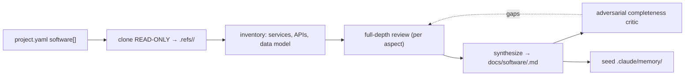

# Understand the software (full depth)

For **each** software repo in `project.yaml` `software:`, produce a `docs/software/<name>.md` so tests can verify the product's cloud/backend/app behaviour (e.g. "did this DUT's telemetry actually land, and is it correct?"). This is a **testing reference** — you never edit the software. If there are no `software:` entries, note that in `PROJECT-STATUS.md` and skip to `/define-use-cases`.



## ⛔ Hard stop — READ-ONLY, and never write software
Clone **shallow + read-only** into the gitignored `.refs/<name>/`, read, and produce docs. Never modify, commit, push, branch, or PR the software repo. You do not author or edit software anywhere. Software bugs become **issues** (via `/triage`, routed to that software repo), never code changes. Never `git add` anything under `.refs/`.

## Phase 0 — Get the sources (read-only)
For each `software:` entry, clone shallow into `.refs/<name>/`. `ref:` may be a branch, tag, or **commit SHA**, so fetch + checkout rather than `--branch`:
```powershell
git clone --depth 1 --no-tags <repo> .refs/<name>
git -C .refs/<name> fetch --depth 1 --no-tags origin <ref>
git -C .refs/<name> checkout --detach FETCH_HEAD
git -C .refs/<name> remote remove origin   # mechanically prevent ANY push back to the read-only source
```
Record `git -C .refs/<name> rev-parse HEAD` for the doc header. Never `git add` anything under `.refs/`. Removing `origin` makes the read-only guarantee mechanical, not just behavioral.

## Phase 1 — Inventory
Map the repo: stack/framework, services/components, API surface, config (device profiles, rule chains, transforms), data model/schemas, dashboards, deployment, and the repo's **issues/changelog** (known gotchas).

## Phase 2 — Full-depth review
**The requirement is depth**: cover every aspect below by reading the real source and citing files — sequentially by default. **If your session supports orchestration** (ultracode / the Workflow tool), parallelize with a fan-out workflow (one agent per aspect → synthesize → adversarial critic) like `/understand-hardware`'s; otherwise do the same by hand. The workflow is only an accelerator — depth + citations are mandatory. Aspects:
- **services/components** — what runs, how the parts fit, the stack.
- **data & telemetry model** — device model, the **expected telemetry keys/schema/units**, what "the device checked in" looks like in the data, retention/aggregation.
- **device identity & provisioning** — how a physical DUT maps to a cloud device (the `DUT-serial → device_id` mapping `secrets/device_map.yaml` holds), credentials, registration.
- **interfaces a test can drive** — API endpoints + auth (e.g. the timeseries query a cloud check calls), webhooks, MQTT topics — concrete enough for `/build-test-plan` to build a cloud check.
- **expected behaviour** — rule chains / alarms / transforms the software applies to device data; what a correct end-to-end looks like.
- **constraints / cannot** — rate limits, data the product doesn't expose, environment differences (staging vs prod).
- **known issues** — from repo issues/changelog.

## Phase 3 — Write `docs/software/<name>.md`
Header: name, **repo + reviewed commit SHA**. Then: Identity & role · Services/components · **Data & telemetry model (the schema a test checks)** · Device identity & provisioning (serial→device mapping) · **Interfaces a test can drive (endpoints/auth/queries)** · Expected behaviour (rules/transforms) · Constraints/cannot · Known issues · Test hooks · **Sources & gaps** (files + SHA + honest unknowns). At least one Mermaid block (data-flow diagram). Gaps over guesses.

## Phase 4 — Seed memory
Write durable facts to `.claude/memory/`: the telemetry schema/keys a check-in test asserts, the serial→device mapping convention, the exact API/query to verify check-in, auth/least-privilege notes, and known software gotchas.

## Phase 5 — Update status
Mark Phase 3 done in `PROJECT-STATUS.md`; point "next" at `/define-use-cases`.

## Guardrails
- READ-ONLY on software repos; you never write software (hard stop). Never `git add` `.refs/`.
- Cite sources; record the reviewed commit SHA; gaps over guesses.
- One doc per software repo. Skip cleanly if there are no `software:` entries.
