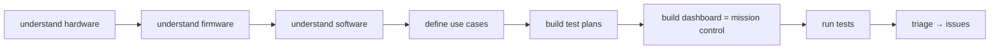

# <product> testing repo — guidance for Claude

This is a **flexible, greenfield testing repo for one product**, generated from `vx-testing-template`. It's a *starting point*, not a cage: build whatever this board actually needs — one use case or twenty, a quick IO check or a full sleep-current + cloud soak — however the testing should work. There is **no shared test engine**; you flash, observe, measure, and judge using the tools already on this machine (below), and you grow this product's own tests, commands, and dashboard as you go. The product and its read-only source repos are in [project.yaml](project.yaml).

## What's already installed & ready (your toolbox)
The machine was set up by `vx-station-setup`, so these are ready — no need to reinstall:
- **Flash**: SEGGER J-Link (drive it via `pylink` / `pylink-square`) and `nrfutil device program`. (`nrfjprog` too, if the engineer added it.)
- **Observe**: `pyserial` (UART), `pylink` (J-Link RTT).
- **Measure**: `ppk2-api` (Nordic PPK2 current/power).
- **Cloud**: `requests` (+ `python-dotenv` for creds) to query ThingsBoard / a product API.
- **Share**: Tailscale (expose a dashboard off-bench).
- **Deeper analysis (optional reference)**: *if* the **hardwaremcp** / **firmwaremcp** MCP servers happen to be connected in your session, `/understand-hardware` and `/understand-firmware` will use them to go deeper (Altium-export parsing, SoC/module/DataType catalogs, safety/readiness analysis). They're a reference aid, **not part of this repo** — if absent, those skills do a thorough manual review instead. (This repo stays greenfield; don't add MCP config to it.)
- Standard Python. **Need something else? Just `pip install` it here and keep going** — that's expected, not a workaround.

## ⛔ The one hard rule — source repos are READ-ONLY, forever
The only thing you may **never** do: the repos under `hardware:`, `firmware:`, `software:` in `project.yaml` are **references**. Read them (the understand-skills clone them read-only into the gitignored `.refs/`, with the remote removed). **Never** modify, commit, push, branch, or PR them, and **never write or edit firmware or software**. A bug you find → file an **issue** on that repo (see Issues), never a code change. Everything else in this repo is yours to shape.

## A suggested path (adapt freely — skip, reorder, extend)
These skills take a board from "nothing" to "tested." Use what fits; this is guidance, not a gate:
| Skill | Builds |
|---|---|
| `/understand-hardware` | `docs/hardware/<name>.md` — what each board is and isn't |
| `/understand-firmware` | `docs/firmware/<name>.md` — boot/RTT/serial signatures, variants, settings |
| `/understand-software` | `docs/software/<name>.md` — telemetry model + interfaces (skip if none) |
| `/define-use-cases` | sharpen `USE-CASES.md` into testable scenarios |
| `/build-test-plan` | `tests/<use-case>/` — a bespoke plan per use case **and per scope** (IO only, sleep-current only, full…) |
| `/build-dashboard` | `dashboard/` — this product's **mission control** |
| `/run-test` | flash, run a plan, observe, judge pass/fail |
| `/triage` | turn failures into issues, routed to the right repo |

**Tests separate however the product needs.** One board may have a single use case; another may run the same firmware with different settings, or different firmware images, for different use cases — so you'll have different tests per use case, and often per *scope* (just the IO board, just sleep current, or the whole thing).

**Add your own commands.** This repo can grow its own `.claude/commands/` for whatever this board needs — e.g. `/test-io`, `/test-sleep-current`, `/test-all`, `/flash-variant`. Build the verbs that make testing this product fast; nothing here stops you.

## The dashboard is mission control
`/build-dashboard` is more than a results view — make it this product's **command center**: buttons to run specific tests (IO, sleep current, full), live pass/fail, and the measurements that matter. A button can run a test directly, or drop a request a watching Claude session picks up and executes — so the dashboard becomes where you *drive* testing from, not just watch it (like BLG mission control). Build it however fits (static page, small Flask/Streamlit app); expose it over Tailscale for off-bench access.

## Issues — each domain routes to its own repo
A **hardware** defect → that **hardware repo**; **firmware** → that **firmware repo**; **software** → that **software repo**; a **test/bench** problem → **this** repo. `/triage` classifies, routes (by the `name` in `project.yaml`), dedups, and mirrors locally.

## Where things live (conventions, not rules)
| Path | What |
|---|---|
| `project.yaml` | product + read-only hardware/firmware/software refs + cloud + bench |
| `USE-CASES.md` | what the product must pass, in prose |
| `docs/…` | hardware/firmware/software understanding |
| `tests/<use-case>/` | bespoke test plans + scripts |
| `dashboard/` | this product's mission control |
| `results/` | run outputs (raw gitignored; summaries kept) |
| `issues/` | local mirror of filed issues (↔ GitHub) |
| `secrets/` | gitignored creds + device map; only `*.example` tracked |
| `.refs/` | gitignored read-only clones of the source repos |
| `.claude/` | this repo's skills, commands, memory — **extend freely** |

Keep run outputs in `results/` and hard-won facts in `.claude/memory/` so future sessions benefit — but the shape of everything else is yours.
