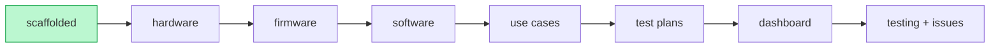

# Project status

> The lifecycle skills update this so any new session knows where it is. Check it first.

| Phase | Skill | Status |
|------|-------|--------|
| 0 · Scaffolded | `/new-test` (in vx-station-setup) | ✅ done |
| 1 · Hardware understood | `/understand-hardware` | ✅ done — [docs/hardware/main-board.md](docs/hardware/main-board.md) |
| 2 · Firmware understood | `/understand-firmware` | ✅ done — [common](docs/firmware/vx_ioboard_fw-common.md) + [tank](docs/firmware/tank-monitor.md)/[callbox](docs/firmware/callbox.md)/[rtu](docs/firmware/rtu.md) |
| 3 · Software understood | `/understand-software` (skip if no `software:` repos) | ⏭️ pending — deferred past Phase 4; **needed for cloud check-in (C5)**: resolve AWS↔ThingsBoard flow |
| 4 · Use cases defined | `/define-use-cases` | ✅ done — [USE-CASES.md](USE-CASES.md) |
| 5 · Test plans built | `/build-test-plan` (one per use case) | 🔄 in progress — [tank-monitor](tests/tank-monitor/plan.md) (S1-S5) + [cloud-checkin](tests/cloud-checkin/plan.md) (C5) built; callbox/rtu pending |
| 6 · Dashboard built | `/build-dashboard` | ✅ done (tank-monitor) — [dashboard/](dashboard/) static view over `results/*/tank-monitor/*.json` |
| 7 · Testing + issues | `/run-test` · `/triage` | 🔄 in progress — flashed on real DUT; **S1 boot/identity PASS**; S2 (cloud) + S3/S4/S5 (IO stimulus) pending |

**Current phase:** 6 done for tank-monitor → 7 (run-test) is next and now UNBLOCKED.
**Next command:** `/run-test` (or the sequenced bench run) on the real tank board. The two old
blockers are cleared: (a) the v2.0.4 tank hex IS on disk (`TANK_IMAGE`/`FACTORY_DATA_IMAGE` →
`config.py:14-19`) — note it's the **release** image (NO `WITH_TESTBENCH`), so S2 power/analog is
verified **cloud-side**, not via RTT self-test brackets; (b) the J-Link is free (probe `822006519`).
Real remaining gates before/around the run: verify board health after the 24 V incident
(`flash_board.py --verify-live`, read-only) BEFORE flashing; the DUT is offline/STALE (~23.5 h,
likely fw#311) and a reflash should restore it. Meanwhile: `/understand-software` (still pending —
resolve the AWS↔ThingsBoard path before C5 + cloud-deferred tank scopes can be graded), or
`/build-test-plan` for callbox/rtu.

## Log
- Scaffolded from `vx-testing-template`.
- Phase 1 — hardware reviewed (`/understand-hardware`, manual; hardwaremcp not connected).
  VX-0057 Rev B @ `f106f8c`: nRF5340 (Minew MS455SF1) host + Quectel EC21-A cellular/GNSS
  + SX1262 LoRa 915MHz; 4 DI (opto), 4× 4-20mA, 1× 0-10V, 4 relays, 2 siren/light, RS-232/485.
  → [docs/hardware/main-board.md](docs/hardware/main-board.md). Memory seeded; 6 items flagged
  to verify (notably relays K3/K4 on NFC pins).
- Phase 2 — firmware reviewed (`/understand-firmware`, manual + 4 parallel read-only sub-agents;
  firmwaremcp not connected). `vx_ioboard_fw` v2.0.4 @ `0097161`: Zephyr/NCS, nRF5340; the 3
  images are build variants (type 0/1/2). Telemetry is **cellular→AWS IoT** (LoRaWAN disabled);
  RTT logging; built-in boot self-test (`FULL_TESTBENCH`) is the key IO test hook. → common +
  3 variant docs. Memory updated; ~14 issues/gates flagged (committed AWS private keys [High],
  factory-data getter UB [High], chip-erase needed for K3/K4, default build = turnstile, cloud
  path ≠ project.yaml ThingsBoard). **Out-of-tree `zephyr_boards` board repo not reviewed.**
- Phase 4 — use cases sharpened (`/define-use-cases`, with engineer). 3 images → testable scenarios
  in [USE-CASES.md](USE-CASES.md): common C1-C5 (boot/identity, IO+power self-test, cellular,
  LoRaWAN, cloud) + per-variant tank/callbox/rtu IO. Scope (engineer): verify cloud via **RTT now,
  forward to ThingsBoard over Tailscale later**; radio prereqs (SIM/gateway/antennas) present;
  sleep-current deferred (no PPK2). Field-IO stimulus rig + accuracy/timing thresholds left as
  open items to confirm in `/build-test-plan`. (Software Phase 3 still pending — see above.)
- Phase 5 (partial) — **tank-monitor** test plan built (`/build-test-plan`):
  [tests/tank-monitor/](tests/tank-monitor/) with `plan.md` + runnable `run.py` (scopes S1 boot,
  S2 self-test, S3 thresholds, S4 relay, S5 siren), pure parsers grounded in firmware
  (events=DT61/DT113 uplink not RTT; relay=INFO RTT; siren=DBG→multimeter; default thresholds
  HH10/H9/L8/LL7 mA, relay/siren on5/off10 mA). Offline parser self-test `test_parse.py` = 18/18.
  Added `/test-tank` command. **Needs:** a built tank image (`TANK_IMAGE`), field-IO rig for S3-S5,
  cloud path for event/DT113 verification. Toolbox: pylink/pyserial/nrfutil/nrfjprog present, **no
  PPK2**, no prebuilt image.
- Phase 5+ (2026-07-06) — **automated 4-20 mA injection** wired into the tank plan (no hardware yet).
  Added `tests/tank-monitor/waveshare.py` (driver for the engineer's **Waveshare Modbus RTU Analog
  Output 8CH**, SKU 26419: holding regs `0x0000..0x0007` = AO1..AO8 in **uA**, FC03/06/16; fixed
  0-20 mA hardware, **4-20 mA emulated in software**, outputs volatile). `run.py` now auto-injects the
  S3/S4 sweep currents when `WAVESHARE_PORT` is set (else identical manual prompts, pre-filled) and
  zeroes all channels on open/exit. `config.py` gained `WAVESHARE_*` + `AI_TO_AO`. All console output
  made ASCII-only (cp1252-safe). Deps: `tests/tank-monitor/requirements.txt` (pymodbus>=3.0, pyserial).
  Verified offline: 18/18 parser tests still pass, modules import, injector no-port fallback works.
- Phase 6 (2026-07-06) — **dashboard built** (`/build-dashboard`). `dashboard/build.py` is a
  dependency-free static-HTML generator over `results/*/tank-monitor/*.json` → `dashboard/index.html`:
  runs table (S1-S5 colored PASS/FAIL/REVIEW) + per-run drill-in (identity, power/analog grid, S3/S4/S5
  step tables incl. injector auto-vs-manual, RTT-log links). Read-only; does **not** touch the J-Link.
  Verified against synthetic runs (all content + ASCII checks pass). Command-center buttons that would
  shell out to `run.py` are deliberately deferred (they'd drive the reserved J-Link) — see
  [dashboard/README.md](dashboard/README.md).
- Bench reality (2026-06-12): the in-house board is **programmed but APPROTECT-locked** (RTT blocked
  → can't observe over J-Link); verify it **cloud-side**. Stimulus rig = **manual single-channel Riiai
  4-20mA source** (B099DZVG9F). Tailscale endpoint = `https://vx-hil-bench1.taile5312a.ts.net`
  (`vx-station` Flask dashboard, read-only, bearer token in `secrets/station.env`) — currently
  **offline** (tailscaled can't reach coordination server; user to restore). Built
  **[cloud-checkin](tests/cloud-checkin/plan.md)** (TB REST verifier) + `/test-cloud` — runnable once
  `VX_TB_*` creds + device VDUI/UUID are in `secrets/station.env`. Will empirically settle AWS-vs-TB.
- Phase 7 prep (2026-07-07) — **first-run readiness fixes** (no hardware touched). (1) Confirmed the two
  old Phase-7 blockers are cleared: `TANK_IMAGE`+`FACTORY_DATA_IMAGE` are on disk (release v2.0.4 dev) and
  the J-Link is free. (2) **Fixed the S3/S4 band bug** in `run.py`: it hardcoded the 7-10 mA compile
  defaults; now it uses the live device's cloud-configured bands via `config.py` (`S3_BANDS_CONFIGURED`
  12-18 mA, new `S4_STEPS_CONFIGURED` bracketing OFF~13/ON~17 mA, and `classify_level` gets
  `CONFIGURED_THRESHOLDS_UA`). Added relay `on:17000` to config (from TB telemetry 2026-07-07). (3)
  Verified: `test_parse.py` 18/18 still pass; `run.py`/`config.py` import clean; `flash_board.py --dry-run`
  OK (10 words @0xFC000, both hexes resolved). Bench-dependent steps (verify-live → flash → S1 RTT →
  cloud re-verify → S3/S4/S5) are handed off to the operator (need 12 V PSU safety + the physical probe).
- Phase 7 FIRST REAL RUN (2026-07-07) — **flashed + S1 PASS on the live DUT** `104D1526064B6130`.
  (1) `flash_board.py --verify-live` OK → 0xFC000 matches computed keys, APPROTECT open ⇒
  **board survived the 24 V incident** (B1 cleared). (2) `flash_board.py` full flash of v2.0.4 dev OK
  (recover → erase → settings → APPROTECT/SECUREAPPROTECT → merged+factory → reset; RTT open).
  (3) `run.py boot` initially FAILed on a **test-bench bug**, now fixed: firmware boot prints
  `Firmware title io_tank_monitor` AND `Application type io_board_app_tank_monitor` — the runner
  expected the title string as the app type. Corrected `config.py APP_TYPE`, the fixture, and
  `test_parse.py` to `io_board_app_tank_monitor` (RTT + cloud both use this). Re-run **S1 = PASS**
  (`v2.0.4-h-d4ca9f20`, reached `Viaanix APP Init`); offline suite 18/18. Dashboard rebuilt (2 runs).
  Next: poll cloud for the reflashed device coming online (was STALE ~23.5 h) = cloud-side S2, then
  S3/S4/S5 with the Riiai injector.
- Phase 7 cloud + thresholds (2026-07-07) — **cloud verified working; device BACK ONLINE.** Read-only
  `check_checkin.py` connected to `portal.dev.vxolympus.com` and pulled fresh telemetry (0.6 min old,
  PASS) => the reflash cleared the offline state AND proves the full device->cellular->AWS->ThingsBoard
  path (settles B3 empirically: telemetry DOES land on TB). Cloud-side S2 data present (analog uA, power,
  resets, `fwVersion v2.0.4 hash: d4ca9f20`). **Thresholds changed post-reflash** (factory-default reset):
  live = HH20000/H15000/L5000/LL2000, relay on20000/off15000 (all channels) - NOT the earlier
  18/16/14/12. Added **`thresholds.py`** (read-only, reuses cloud tb_client) that reads live per-channel
  thresholds and derives S3/S4 sweep plans, flagging bands a 4-20 mA source can't hit; `run.py` S3/S4 now
  call `TH.resolve()` (live cloud, else config fallback) instead of static bands. **Finding:** at the
  current factory thresholds HIGH_HIGH (20 mA = loop ceiling) and the relay-ON crossing are UNREACHABLE,
  and LOW_LOW (2 mA) needs 0-20 mA mode - so a full S3/S4 sweep needs operational thresholds pushed
  (bands inside 4-20 mA). Verified: imports OK, 18/18, `python thresholds.py` prints the live plan.
  NOTE: portal password was pasted in chat this session -> recommend rotating it; station.env creds used.
- Multi-board STATION dashboard (2026-07-07) — built a Siffron-style program+test dashboard modeled on
  `C:\claude\siffron\siffron_qa\control_dashboard.py`. New files under `tests/tank-monitor/`:
  **`station.py`** (stdlib http.server, VDUI combobox + merged/factory hex dropdowns + J-Link dropdown,
  stages Flash/Boot/Cloud/Full/Batch, RUN_LOCK + PROBE_LOCK + cooperative Stop, PSU Power ON/OFF, live
  `/status` poll, batch tally + `results/station/batch_*.csv`); **`devices.py`** (VDUI->AppEUI/AppKey
  from `secrets/device_map.xlsx`, openpyxl, falls back to the single config.py device); **`psu.py`**
  (GPD-3303S driver with the global-output-enable safety). Reuses the proven `flash_board.program`,
  `tankmon.capture_rtt/parse_boot`, and `cloud-checkin/tb_client`. Per-board pipeline = FLASH (identity
  @0xFC000 + APPROTECT + merged+factory) -> BOOT/identity (RTT) -> CLOUD check-in (polls TB up to 300s).
  Safety: only the selected VDUI is flashed/commanded; cloud read-only. Added `openpyxl` to requirements
  + `secrets/device_map.example.xlsx` template. Verified: loaders, page render, all endpoints HTTP 200;
  runs on http://127.0.0.1:8792/. Hardware stages reuse modules already validated live this session.
  To enable PSU set `PSU_PORT=COM4`; to load all boards drop the VDUI Excel at `secrets/device_map.xlsx`.
- Reference repos consolidated in `refs/` (2026-07-07) — cloned the **vendor testbench** (`Viaanix/
  vx-testbench-releases`, release `ioboard-1.0.0`) to `refs/vx-testbench-releases`, and confirmed
  `refs/VX-0057` (Altium hardware) is a full clone (refreshed). KEY FINDINGS: (1) The vendor ships a
  Java testbench `vxtools-testbench-*.jar` driven by a JS test script (`rtu-test/test.js`) + a VDUI
  Excel (`dummy-id.xlsx`, cols VDUI/AppEUI/AppKey - same schema as our device_map) + a **WITH-TESTBENCH
  firmware** (`merged.hex` + `rtu-fw-vx-0057-factory_data-dev-v2.0.1`), publishing results to ThingsBoard
  via an HTTP integration. **This testbench firmware has the self-test our v2.0.4 release hex lacks** ->
  flashing it would enable on-bench S2 (read over SERIAL/RTT). (2) Official `test.js` procedure = Program
  -> AC Power (External Power 12v OFF + PSC 60 AC ON) -> DC Power (12v ON + meter current, limit 0.5A,
  normal 200-300mA) -> I/O (Flash mem, DI1-4 low/high, **AN1-5**, RS232, RS485) -> Comm (LoRaWAN join
  workaround, Cell serial/SIM). Uses GW-Instek **GPD3303 PSU + GDM8251 meter** (jar has drivers for both;
  PPK2 too). RTT CB hardcoded 0x20021BBC for that fw (from zephyr.map). (3) VX-0057 hardware confirmed
  from the 17-sheet schematic: nRF5340; **5 analog inputs** = 4x 4-20mA (MCP6024 buffer, 100R sense,
  0.1% divider) + 1x general 0-10V/24V analog (jumper-selectable rail); 4x opto-isolated DI; 4x relays
  K1-K4 (PE014005, DMN2005K); 2x siren/light (ALARM/LIGHT, P-CH high-side 12V); RS-232 + RS-485
  (THVD1452, 120R term); Quectel cell + SX1262 LoRa (915MHz PCB+U.FL); S25FL128L QSPI flash; 5V/3.5A
  stepdown + TVS protection. The "24V" is an internal analog-input rail (matches the 12V-only supply note).
- Station A->B->C pipeline (2026-07-07) — folded the vendor testbench into `station.py` as a Siffron-style
  pipeline. **A - Hardware Test:** flashes the vendor WITH-TESTBENCH fw (`config.TESTBENCH_MERGED/FACTORY`
  from `refs/vx-testbench-releases`) -> `tankmon.parse_testbench` grades each component (Program, Test
  brackets, External Memory, power, PSC60, DI1-4, AN1-5, RS232/485, LoRaWAN, Cell) + **Current** (source
  order: GDM-8251A `meter.py` if `METER_PORT` set -> PSU `IOUT?` -> SKIP; limit 0.5A). **B - Reprogram:**
  flashes the normal v2.0.4 release (dropdown-selected). **C - Functional:** boot/identity (RTT) + cloud
  check-in. Buttons per stage + **Full (A->C)** + **Batch** (tally + `results/station/batch_*.csv`);
  results shown as per-component indicator lamps grouped by stage. New: `meter.py` (GDM-8251A SCPI,
  per-test `set_mode`), `psu.read_current()`. Verified: imports OK, `test_parse.py` 25/25, all endpoints
  HTTP 200 on http://127.0.0.1:8792/. DI/AN/RS need the testbench-harness to read PASS (advisory on a bare
  board); self-test assumed on RTT (verify on bench - if UART-only, add a serial reader).
- Functional test suite + DT71 settings-writer (2026-07-08) — Functional is now the behavioral test list
  (Analog Tests 1-5 + Siren Scenarios 6-8), guided from the web station with MANUAL simulator injection,
  and the station PUSHES DT71 settings. New: **`settings.py`** (authoritative DT71 codec - `47 LEN TLV`,
  uint16 LE microamps, type table 0x01-0x11; read-current-frame -> patch target TLVs -> write server
  attrs `settingsServer`+`settingsQueued` -> poll the device's DT71 echo `settingsShared`; TEST-DEVICE
  allowlist + `verify_writer()` probe + degrade-to-operator-push); **`functest.py`** (T1-T5, S6-S8 defs);
  **`tb_client.save_server_attributes`** (only write). `station.py` gained a Functional Tests panel (T1..S8
  buttons + AI selector), an interactive Continue mechanism (`_await_operator` + `POST /continue`, threading
  Event), per-test capture+grade (RTT `parse_tank_events` bands/relay/DT113/siren + cloud
  `thresholdLevelType`/`digitalOutput`/appLogic + multimeter volts entry), and per-test lamp panels.
  DT71 encoding is uint16 LE uA (NOT float32 - firmware-confirmed); the safe RPC-free push path is the
  "Downlink Queue Handler" rule chain. Verified: `test_dt71.py` 12/12, `test_parse.py` 25/25, imports OK,
  endpoints HTTP 200, T1 starts -> awaiting -> correct prompt -> func_results populate -> continue/stop work.
  Order to run on bench: `settings.verify_writer()` probe -> T1/T2 (no settings) -> T3/T4/T5 -> S6/S7/S8.
