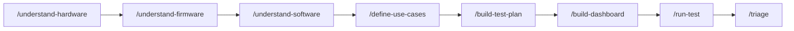

# &lt;product&gt;-testing

Isolated, **bespoke** testing repo for one product, generated from [`vx-testing-template`](https://github.com/Viaanix/vx-testing-template) by `/new-test`. Everything here is built for *this* product — there's no shared test engine. You understand the hardware/firmware/software, define use cases, build a test plan per use case, build a dashboard, then flash and test the board.

## Prereqs
The bench machine is set up via [`vx-station-setup`](https://github.com/Viaanix/vx-station-setup) (J-Link, nrfjprog, nrfutil, Python + serial/RTT/PPK2 libs). If a test needs another library, `pip install` it here.

## Working in this repo (in a Claude session)
Run the lifecycle skills in order — they update [PROJECT-STATUS.md](PROJECT-STATUS.md) so you always know where you are:

1. `/understand-hardware` — full-depth review of each hardware repo → `docs/hardware/*.md`
2. `/understand-firmware` — full-depth review of each firmware repo → `docs/firmware/*.md`
3. `/understand-software` — full-depth review of each software repo → `docs/software/*.md` (skip if none)
4. `/define-use-cases` — sharpen [USE-CASES.md](USE-CASES.md) into clear, testable scenarios
5. `/build-test-plan` — a bespoke plan + scripts per use case → `tests/<use-case>/`
6. `/build-dashboard` — this product's own results view → `dashboard/`
7. `/run-test` — flash the board, run a plan, observe, judge pass/fail → `results/`
8. `/triage` — turn failures into issues, **routed to the right repo** (hardware→hardware, firmware→firmware, software→software)

> The hardware, firmware, and software repos are **read-only references** — reviewed in place, never modified. See [CLAUDE.md](CLAUDE.md).
