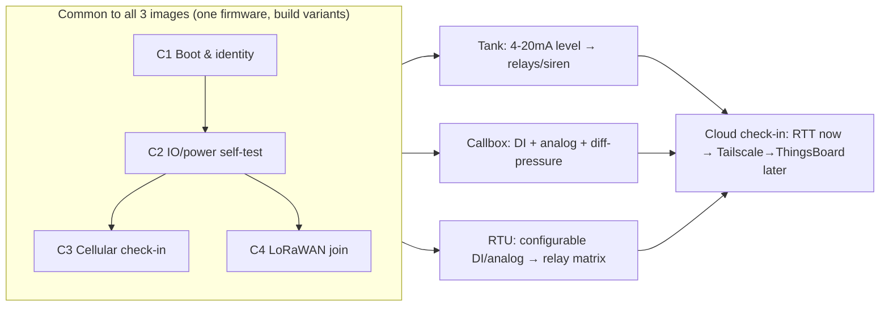

# Use cases — what this product must pass (testable)

> **NOTE (updated 2026-07-07, from live RTT):** **`DT113` IS real** — the firmware logs it for
> tank-level/threshold events (matches the QA test spec), and also logs **`DATA_TYPE_61`** for the
> check-in (`vx_app: DT113`, `vx_app: DATA_TYPE_61` seen on RTT). An earlier "no DT113" note was
> wrong and is reversed. Cloud exposes decoded `tankNumber`/`thresholdLevelType`/value.

> Sharpened by `/define-use-cases` from the engineer's prose, grounded in
> [docs/hardware/main-board.md](docs/hardware/main-board.md),
> [docs/firmware/](docs/firmware/) (common + tank/callbox/rtu), and `.claude/memory/`.
> `/build-test-plan` turns each scenario into a bespoke plan under `tests/<use-case>/`.
> Still prose — but every scenario says exactly what "pass" means.

## How to read these / bench profile
- **Bench:** J-Link only (`jlink:true`, `ppk2:false`, `serial:false`). **Observe over RTT.**
  No current measurement. Power the DUT from **12 V into J36**.
- **Images are build variants of one repo** (`vx_ioboard_fw` v2.0.4). Build with
  `WITH_APPLICATION_IO_BOARD_TYPE` = 0 tank / 1 callbox / 2 rtu, **`WITH_TESTBENCH=y`** to get
  the built-in self-test + radio tests, dev endpoint. ⚠️ **Default build is turnstile (3)** —
  set the type explicitly. **Flash with a full chip-erase** (UICR → NFC pins as GPIO, or relays
  K3/K4 won't switch).
- **Cloud verification = RTT for now.** Telemetry publishes to **AWS IoT**, not the ThingsBoard
  portal; the plan is to **forward check-in data over Tailscale to ThingsBoard** (built in
  `/build-dashboard`, after `/understand-software` resolves the AWS↔ThingsBoard flow). Until then
  a "successful check-in" is proven by the RTT publish/join lines, not a cloud-side read.
- Each scenario lists **Observable signal**, **Pass/fail**, **Preconditions/caveats**,
  **Priority**, and **Exercises** (for issue routing). Numbers tagged **⟶ confirm** are proposed
  defaults the engineer should ratify (not yet authoritative).
- **Field-IO stimulus rig (DI/relay/4-20mA/analog/RS-232/485) is an open decision** (fixture vs
  manual instruments) — settled per scenario during `/build-test-plan`. Where a scenario needs
  stimulus it says so explicitly; **without a rig, the self-test's DI/analog/RS echo lines will
  report ERROR/OFF — that's "not stimulated," not a true failure.**

---

# Part A — Common scenarios (apply to tank-monitor, callbox, rtu)

## C1 — Boots and reports the correct image  · Priority P0
**Scenario.** Flash a clean image (chip-erase) for the chosen variant, power from 12 V, attach
J-Link, capture RTT from reset.
**Observable signal.** RTT lines (tags `vx_app_version`, `vx_app`): `Firmware title …`,
`Firmware version …`, `Application type io_tank_monitor|io_call_box|io_rtu`, `Compile time …`,
then `vx_app: Viaanix APP Init`.
**Pass/fail.** PASS if all version lines appear **and** `Application type` matches the intended
variant **and** `Viaanix APP Init` is reached, with no fatal/reboot in between. Version string
matches the flashed build. Time-to-`Viaanix APP Init` ≤ **15 s** ⟶ confirm.
**Preconditions/caveats.** RTT (not UART). `CONFIG_ASSERT` is off → faults show as a Zephyr fatal
dump + reset, then reset-reason lines on next boot. MCU reset-reason always logs `MCU_RESET_PWRON`
(read disabled in fw) — use the app-level reason, not the MCU one. **Detach/disable the watchdog
or expect a reset if you halt at a breakpoint** (120 s WDT runs under the debugger).
**Exercises.** FW (common) · HW (power, SWD).

## C2 — IO / power self-test passes  · Priority P0
**Scenario.** With a `WITH_TESTBENCH=y` build, the firmware runs `VxAppTestbench_Run()` at boot
and prints a bracketed self-test over RTT (tag `testbench`).
**Observable signal.** Between `***IO BOARD TEST STARTED***` and `***IO BOARD TEST ENDED***`:
`Firmware Version: …`; `Main Power 13.8v or 12v: ON`; `External Power 12v / PSC 60 AC / PSC 60
Power 13.8V / PSC 60 Battery: …`; `External Memory: OK`; `DI%d_…: …`; `AN%d: … (%d uA)`;
`RS232 ECHO COMMUNICATION: OK`; `RS485 ECHO COMMUNICATION: OK`.
**Pass/fail.** PASS (always-valid on a bare board): `External Memory: OK`, the powered rail lines
reflect the actual bench supply, and the test brackets both print. PASS (full, **requires the IO
rig**): every `DI`, `AN`, and `RS232/RS485 ECHO` line reports its expected stimulated value /
`OK`. FAIL: `External Memory: ERROR`, a power rail reads wrong vs the bench, or any stimulated
channel mismatches.
**Preconditions/caveats.** `RS232/RS485 ECHO` needs a **loopback**; `DI`/`AN` lines need
**stimulus** — on a bare board these are expected to read OFF/0 and are *not* failures. Decide the
rig per C2/Part-B (open item). 4-20 mA → µA uses factor 157.3 (`io_handler.c`).
**Exercises.** FW (common, testbench) · HW (power, ext-flash, DI/analog/RS-232/485).

## C3 — Cellular connects and check-in publishes  · Priority P1
**Scenario.** Insert an activated SIM, fit the cellular (MAIN/GNSS) antenna, boot a
`WITH_TESTBENCH=y` build; the cell test + the normal OS/APP check-in run.
**Observable signal.** RTT: testbench `CELL SERIAL: OK`, `CELL SIM: OK`; cell handler
`SIM is ready`, `cell: registered to network`; on check-in `CELL PUBLISHing` → **`CELL PUBLISH
SUCCESS`** (tag `cell_handler`).
**Pass/fail.** PASS if SIM detected, modem serial OK, **registers to network**, and at least one
**`CELL PUBLISH SUCCESS`** is seen. FAIL on `SIM is not detected`, `cell: not registered to
network`, `cell: AWS MQTT Connect Failed`, or `cell: failure too many times`. Time-to-registration
≤ **90 s**, first publish ≤ **120 s** ⟶ confirm.
**Preconditions/caveats.** Live LTE coverage + data-enabled SIM required. `cell_handler` logs are
silenced when `FULL_TESTBENCH=y` — for the post-boot publish lines, watch a non-full build or the
testbench's own `CELL …` lines. Telemetry targets **AWS IoT dev** (`mqtt.dev.viaanix.io`) — this
scenario proves the *device-side* publish, not a cloud-side read (see C5).
**Exercises.** FW (common, CellHandler) · HW (EC21, SIM, antenna) · SW (AWS/cloud — pending).

## C4 — LoRaWAN joins (US915) and uplinks  · Priority P1
**Scenario.** Fit the LoRa antenna (confirm PCB-vs-U.FL build option populated), ensure US915
gateway coverage, boot a `WITH_TESTBENCH=y` build (and/or a `WITH_LORAWAN=y` + LoRaWAN-enabled
build, since runtime comms are otherwise forced cellular-only).
**Observable signal.** RTT (tag `lorawan_comm` / `testbench`): `Joining network over OTAA…` →
**`Lorawan join SUCCESS`** (or testbench `LoraWAN Join: OK`); on uplink `Sending LoRaWAN data on
port %d…` → **`Packet send success`**.
**Pass/fail.** PASS if **OTAA join succeeds** and (if exercised) an uplink reports `Packet send
success`. FAIL on `Lorawan join FAIL` / `LoRaWAN join failed` after retries, or `Join EUI is
invalid…`. Join within ~**30 s** ⟶ confirm (testbench uses a ~20 s window).
**Preconditions/caveats.** Provisioned DevEUI/JoinEUI/AppKey in NVM (a `0xFF` JoinEUI disables
LoRa). **The shipped app forces cellular-only** (`com_handler.c` hot-fix) + `VX_ENABLE_LORAWAN`
default off — so a runtime LoRaWAN uplink needs a LoRaWAN-enabled build; the **testbench join test**
runs independently and is the simplest pass signal. Confirm the populated antenna path first.
**Exercises.** FW (common, lorawan_comm) · HW (SX1262, antenna).

## C5 — Cloud check-in visible (deferred / Tailscale→ThingsBoard)  · Priority P2
**Scenario.** After C3, the device's check-in payload (JSON with `ph` = hex DataType blob) reaches
the cloud; we want to confirm it end-to-end.
**Observable signal.** Now: the C3 RTT `CELL PUBLISH SUCCESS` + the decoded DataTypes the build
queued (DT88/DT108 at boot OS check-in; DT90+DT104 on APP check-in). Later: the same record
surfaced on **ThingsBoard** via the Tailscale forwarder/dashboard, keyed by device VDUI.
**Pass/fail.** Interim PASS = `CELL PUBLISH SUCCESS` for an OS and an APP check-in. Full PASS
(deferred) = the matching telemetry record appears on the ThingsBoard side with correct `sn`,
`cit` (OS/APP), and decoded DT90/DT104 values within the check-in window.
**Preconditions/caveats.** **Open dependency:** telemetry goes to AWS IoT, not the ThingsBoard
portal directly — the AWS→ThingsBoard/Tailscale path must be confirmed in `/understand-software`
(`715-unitedRentals-Cloud`) before the full assertion can be built. Cadence: OS ~24 h (+boot),
APP ~1 h + event-triggered ⟶ confirm whether to shorten for test.
**Exercises.** FW (common, ComHandler/JsonHandler) · SW (cloud) · test-bench (forwarder).

---

# Part B — Tank monitor (`tank-monitor`, build type 0)
Exercises FW `vx_app_tank` + common; HW 4-20 mA inputs, relays, siren/light. See
[docs/firmware/tank-monitor.md](docs/firmware/tank-monitor.md).

## T1 — Level sensing classifies into bands  · Priority P1
**Scenario.** Inject a known current into each 4-20 mA channel (AIN0-3) and sweep across the
configured band thresholds (LOW_LOW / LOW / NORMAL / HIGH / HIGH_HIGH).
**Observable signal.** Self-test `AN%d: … (%d uA)`; app events `VX_APP_EVENT_TANK_LEVEL_*` and
DT113 threshold records (`tank_number`, `threshold_level`, `current_value_ua`); DT104 with
`number_channels = 4`.
**Pass/fail.** PASS if each channel's reported µA tracks the injected current within **±2 % / ±0.1
mA** ⟶ confirm, and band transitions fire at the configured thresholds with the **250 µA
hysteresis** (no chatter at the boundary). FAIL on wrong band, missing DT113, or out-of-tolerance
µA.
**Preconditions/caveats.** Needs a 4-20 mA source per channel (rig TBD). Channel loop power
(12/24 V) jumper set as the sensor expects. Thresholds come from device settings.
**Exercises.** FW `vx_app_tank` · HW 4-20 mA front-end (MCP6024).

## T2 — Fill/drain relay control  · Priority P1
**Scenario.** Drive a channel's level across HIGH/LOW bands and observe the mapped relay output
(pump/valve) actuate via the fill/drain FSMs.
**Observable signal.** Relay continuity COM↔NO / COM↔NC at the WAGO terminals; DT90 `dig_out_*`
bits reflect the commanded state; RTT app/IO logs.
**Pass/fail.** PASS if the correct relay switches at the correct band edge and DT90 output bits
match. **K3/K4 (relays 3-4) only switch after a chip-erase flash** — verify they actuate. FAIL if a
relay doesn't toggle or DT90 disagrees.
**Preconditions/caveats.** Continuity meter / load on relay terminals (rig TBD). Chip-erase flash
mandatory for K3/K4 (NFC pins).
**Exercises.** FW `vx_app_tank` · HW relays (do1-4, incl. NFC-pin K3/K4).

## T3 — Siren/light on threshold  · Priority P2
**Scenario.** With `siren_mode_enabled`, drive a channel to a HIGH_HIGH/alarm condition.
**Observable signal.** 12 V switching at the ALARM/LIGHT outputs; RTT `app_io_test` `Set siren
light/sound to ON/OFF`.
**Pass/fail.** PASS if siren/light outputs assert on the alarm condition and clear when it clears,
only when siren mode is enabled. FAIL otherwise.
**Preconditions/caveats.** DMM/scope on siren outputs. Setting `siren_mode_enabled` on.
**Exercises.** FW `vx_app_tank` · HW siren/light (P-FET high-side).

---

# Part C — Callbox (`callbox`, build type 1)
Exercises FW `vx_app_call_box` + common; HW digital inputs (level sensors) + analog. See
[docs/firmware/callbox.md](docs/firmware/callbox.md).

## B1 — Two-sensor level inputs + fill logic + sensor-fail  · Priority P1
**Scenario.** Drive DI1 (bottom) and DI2 (top) level-sensor inputs through the valid and the
inconsistent combinations; observe fill control and sensor-fail detection.
**Observable signal.** Self-test `DI1_…/DI2_…`; DT90 `dig_in_*` bits; app events
`LEVEL_*`/`SENSOR_FAILS`; controlled relay outputs.
**Pass/fail.** PASS if DI states are read correctly, fill control follows the two-sensor logic, and
an **inconsistent sensor pair raises `SENSOR_FAILS`**. FAIL on misread DI, wrong fill action, or
missing sensor-fail event.
**Preconditions/caveats.** DI excitation rail + ground (common/isolated) jumper set per channel;
DI stimulus rig TBD.
**Exercises.** FW `vx_app_call_box` · HW digital inputs (opto), relays.

## B2 — Analog flow/level + differential pressure  · Priority P1
**Scenario.** Inject currents on the two analog instances (flow, level); verify per-channel
min/max/peak/average accumulation and the computed differential pressure |P1−P2|.
**Observable signal.** 3 s periodic analog log (RTT); app events `PRESSURE_*`/`FLOW_RATE_*`;
**DT104 with `number_channels = 20`** (per-channel current + min/max/avg arrays).
**Pass/fail.** PASS if analog readings track injected currents within **±2 % / ±0.1 mA** ⟶ confirm,
differential pressure = |P1−P2|, min/max/avg accumulate correctly, and the 20-channel DT104 decodes
cleanly. FAIL on wrong math or malformed DT104.
**Preconditions/caveats.** 4-20 mA source (rig TBD). **DT104 is 20 channels for callbox** — the
decoder must handle the expanded record (variant gotcha).
**Exercises.** FW `vx_app_call_box` · HW 4-20 mA front-end · SW (DT104 decode).

---

# Part D — RTU (`rtu`, build type 2)
The most general image — exercises **all** field IO. FW `vx_app_rtu` + common. See
[docs/firmware/rtu.md](docs/firmware/rtu.md).

## R1 — Configurable input→output trigger matrix  · Priority P1
**Scenario.** Configure each of the 4 outputs with on/off triggers (NONE/DIGITAL/ANALOG, with
over/under min/max for analog); drive the corresponding DI1-4 and AIN0-3 and verify the mapped
relay actuates per the rule.
**Observable signal.** DT90 `dig_in_*`/`dig_out_*` bits; DT104 (`number_channels = 4`); app events
`ANALOG_1..4_LOW/NORMAL/HIGH`; relay continuity.
**Pass/fail.** PASS if every configured trigger drives its output correctly for both DIGITAL and
ANALOG logic across min/max thresholds, and DT90 reflects in/out state. FAIL on any mis-mapped or
non-actuating output. (K3/K4 chip-erase gate applies — RTU uses all 4 relays.)
**Preconditions/caveats.** Full DI + 4-20 mA stimulus (rig TBD); output continuity check.
Chip-erase flash for K3/K4.
**Exercises.** FW `vx_app_rtu` · HW DI, 4-20 mA, all 4 relays.

## R2 — State reset on power loss  · Priority P2
**Scenario.** With outputs/sirens active, drop and restore main power (12 V at J36); verify all
output/siren states reset.
**Observable signal.** RTT `Main Power Lost`/`Main Power Restored`, `Resetting states…`; DT90
outputs cleared; relay continuity returns to default.
**Pass/fail.** PASS if outputs/sirens clear on power loss and the device resumes cleanly on restore.
FAIL if an output latches through a power cycle.
**Preconditions/caveats.** Switchable 12 V supply. Note the **5 V supercap hold-up** — brief dips
may not trigger a loss; use a sustained drop. App runs only while main power present.
**Exercises.** FW `vx_app_rtu` · HW power path (ideal-diode/supercap), relays.

## R3 — Dual configurable sirens  · Priority P2
**Scenario.** Configure the two sirens with digital + analog trigger bitmaps; assert the trigger
conditions.
**Observable signal.** 12 V switching at ALARM/LIGHT outputs; RTT siren logs.
**Pass/fail.** PASS if each siren fires per its configured bitmap and clears when the condition
clears. FAIL otherwise.
**Preconditions/caveats.** DMM/scope on outputs; settings configured.
**Exercises.** FW `vx_app_rtu` · HW siren/light.

---

## Cross-cutting preconditions & caveats (apply throughout — from `.claude/memory/`)
- **Chip-erase flash** every test image, or relays **K3/K4** (NFC pins P0.02/P0.03) won't switch.
- **Build the right variant** (`WITH_APPLICATION_IO_BOARD_TYPE` 0/1/2) — default is turnstile.
- **`WITH_TESTBENCH=y`** to get the self-test + radio tests; note it silences `cell_handler` INFO.
- **Observe over RTT** (no serial console). **Watchdog (120 s) resets the board if you halt at a
  breakpoint** — disable WDT for interactive debug.
- **No autonomous sleep** (sleep FSM disabled) and **no PPK2** → sleep-current is **out of scope**
  this round (deferred until a PPK2 is added and/or sleep is enabled in fw).
- **Telemetry → AWS IoT**, not the ThingsBoard portal; cloud-side verification is via the planned
  **Tailscale→ThingsBoard** forwarder, pending `/understand-software`.
- Confirm the **antenna build option** (LoRa PCB vs U.FL) and that RF antennas are fitted.

## Open items to confirm (don't build on these until ratified)
1. **Field-IO stimulus rig** — fixture vs manual instruments (decide per scenario in `/build-test-plan`).
2. **Accuracy tolerance** for 4-20 mA / analog (proposed ±2 % / ±0.1 mA).
3. **Timing windows** — boot-to-ready (15 s), cell registration (90 s) / first publish (120 s),
   LoRaWAN join (30 s); shorten check-in cadence for test?
4. **Cloud verification** — AWS→ThingsBoard/Tailscale data flow (resolve in `/understand-software`).

## Priority summary
| Priority | Scenarios |
|---|---|
| **P0** | C1 boot/identity · C2 IO/power self-test |
| **P1** | C3 cellular · C4 LoRaWAN · T1/T2 tank level+relays · B1/B2 callbox DI+analog · R1 RTU matrix |
| **P2** | C5 cloud check-in (deferred) · T3 siren · R2 power-loss reset · R3 sirens |
| **Deferred** | Sleep current (needs PPK2 + fw sleep) |
