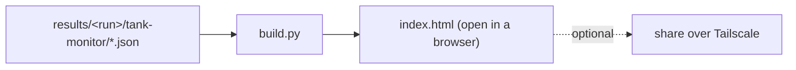

# Tank Monitor dashboard

This product's **own** results view, built by `/build-dashboard` (Phase 6). It's a small,
dependency-free static-HTML generator over `results/` — no shared dashboard engine, no server.



## Build & view

```bash
python dashboard/build.py            # writes dashboard/index.html
python dashboard/build.py --open     # also opens it in the default browser
```

Then open `dashboard/index.html`. Regenerate any time after a
`python tests/tank-monitor/run.py <scope>`; the page is a **read-only** view — it never
touches the board, the J-Link, or the source repos.

## What it shows

- **Runs table** — one row per `run_id`, columns S1..S5, each cell colored by verdict:
  - **PASS** (green) — automatic checks passed (S1 boot/identity, S2 self-test core).
  - **FAIL** (red) — a core check failed.
  - **REVIEW** (amber) — needs a human or is cloud-deferred. S3/S4/S5 are REVIEW by design
    today: the level/relay/siren *events* (DT61/DT113) are verified cloud-side once the
    AWS -> ThingsBoard path is wired (see `tests/cloud-checkin/`). On the bench we currently
    confirm the mapped **relay transitions** (RTT), continuity, and siren voltage.
- **Per-run drill-in** — S1 identity, S2 power/analog/ext-mem grid, S3 threshold sweep table
  (AI/AO/band/mA/expected/relay xitions, and whether the current was injected by the
  **Waveshare** or entered **manually**), S4 relay steps + continuity, S5 siren volts.
- Links to the `.rtt.log` sidecars for S1/S2.

## Data source

Globs `results/*/tank-monitor/*.json`, each an envelope `{scope, run_id, utc, result}` written
by `tankmon.write_result`. Verdict is read from `result.overall`, else `passed`/`passed_core`,
else REVIEW (mirrors `tankmon.py`). Raw `results/` files and the generated `index.html` are
gitignored (build artifacts) — commit `build.py`, not the output.

## Later: command center (deferred)

The `build-dashboard` skill encourages a **command center** with buttons that launch tests.
That's deliberately **not** built yet: launching a scope shells out to
`tests/tank-monitor/run.py`, which drives the **J-Link** (reserved for other use right now).
Add it once the probe is free — a button per scope (`boot` / `selftest` / `thresholds` /
`relay` / `siren` / `all`) that either runs `run.py <scope>` directly or drops a queue entry a
watching Claude loop executes. To reach the page off-bench:

```powershell
tailscale serve --bg --https=443 http://127.0.0.1:<port>
```
