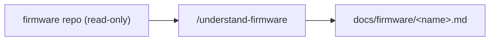

# Firmware docs

> One `*.md` per firmware repo listed in `project.yaml`, **generated by `/understand-firmware`**
> (full-depth, workflow-backed review). These are Claude's reference for boot/RTT/serial signatures,
> build variants, provisioning, expected uplinks, and test hooks — **for reference, never to edit firmware**.
> The firmware repos are **read-only**.

No reviews have run yet. Run `/understand-firmware` to populate this folder.
