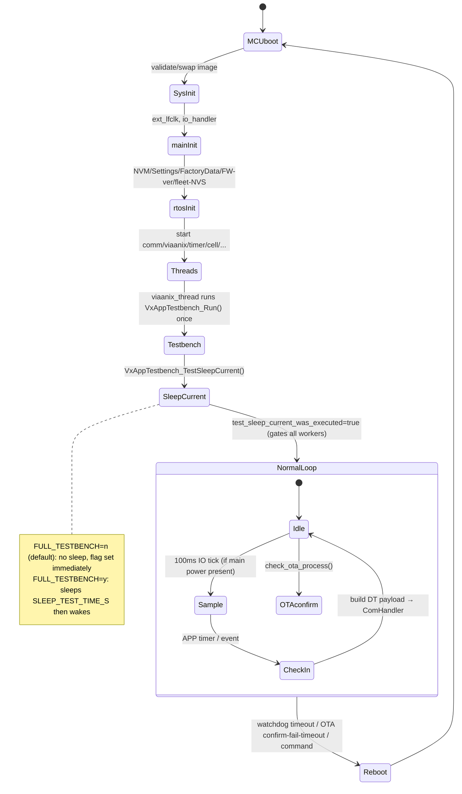
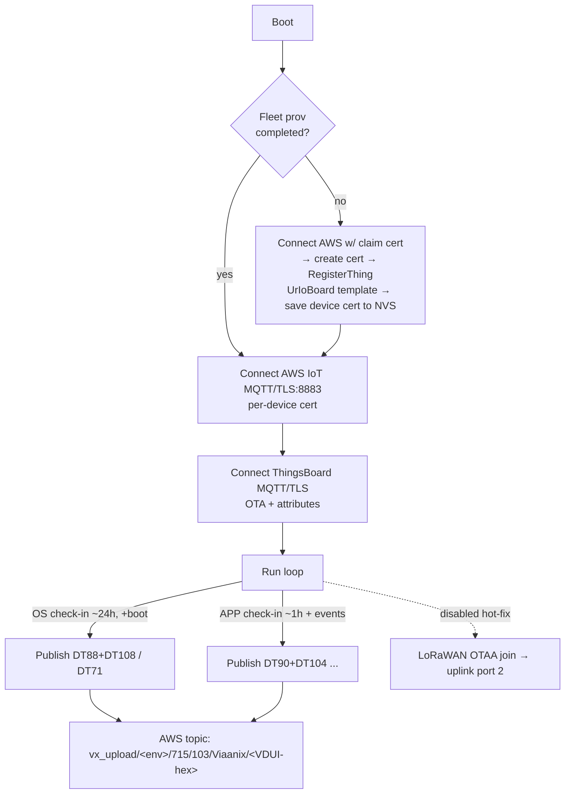
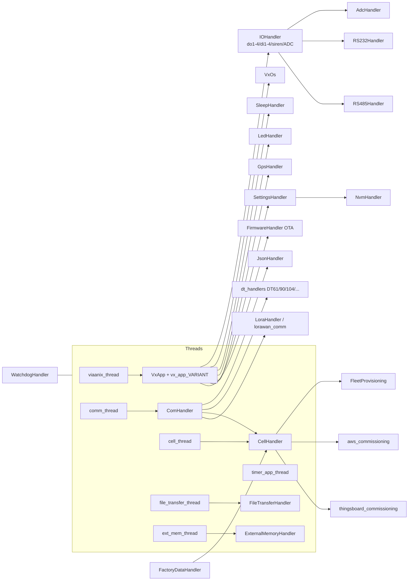

# vx_ioboard_fw — common firmware reference (shared by tank-monitor / callbox / rtu)

> The three firmware images in `project.yaml` (`tank-monitor`, `callbox`, `rtu`) are
> **build-time variants of one repo**, `vx_ioboard_fw`. This file documents everything they
> share — boot, observability, comms, provisioning, build, issues. The per-variant docs
> ([tank-monitor](tank-monitor.md) · [callbox](callbox.md) · [rtu](rtu.md)) cover only what
> each image does *differently*. **Read this first.**

| | |
|---|---|
| **Repo** | https://github.com/Viaanix/vx_ioboard_fw.git (`main`), READ-ONLY |
| **Reviewed commit** | `009716119412fc80e05f9a560b1fc7908a2e81d5` |
| **Firmware version** | **v2.0.4** (`tools/cmake/version.cmake`) — see `CHANGELOG` |
| **Platform** | Zephyr / **nRF Connect SDK** (Viaanix fork `sdk_nrf` @ `e757a90`), nRF5340 app core |
| **Target board** | `vx_0057_b_cpuapp_no_tfm` (also `_a`); **no TF-M** (`tools/make/config.mk`) |
| **Reviewed by** | `/understand-firmware`, manual review (firmwaremcp **not** connected) |
| **HW reference** | [docs/hardware/main-board.md](../hardware/main-board.md) |

> ⚠️ **Out-of-tree board definition.** The Zephyr **board DTS / pinctrl** (the `do1..do4`,
> `di1..di4`, `siren_*`, `analog_in_ctrl`, power-sense, and `zephyr,user` ADC `io-channels`
> node labels, plus the NFC-pin device-tree mapping) live in a **separate** repo,
> `Viaanix/zephyr_boards` @ `b421f6f` (`west.yml`, `import: false`). It is **not** in
> `project.yaml` and was **not** reviewed here. Confirming the exact GPIO→relay/ADC pin
> assignment (e.g. K3/K4 ↔ P0.02/P0.03) requires that repo.

---

## 1. Identity & variants
One application, four mutually-exclusive variants selected at build time by
`WITH_APPLICATION_IO_BOARD_TYPE` in `tools/make/config.mk` → `application-N.conf`:

| N | Kconfig | App-type string | `project.yaml` name | In scope |
|---|---|---|---|---|
| 0 | `CONFIG_APPLICATION_TYPE_TANK` | `io_tank_monitor` | **tank-monitor** | ✅ |
| 1 | `CONFIG_APPLICATION_TYPE_CALL_BOX` | `io_call_box` | **callbox** | ✅ |
| 2 | `CONFIG_APPLICATION_TYPE_RTU` | `io_rtu` | **rtu** | ✅ |
| 3 | `CONFIG_VX_APPLICATION_TYPE_TURNSTILE` | `io_turnstile` | — (not in scope) | ➖ |

The variant sources are `src/app/vx_app_{tank,call_box,rtu,turnstile}.c`, compiled
exclusively via `zephyr_library_sources_ifdef` (`src/app/CMakeLists.txt`). **All four share
the same boot, RTOS, comms, provisioning, and observability** — they differ only in IO
semantics (which inputs/outputs/analog channels, thresholds, sirens, keypad). A release
(`prepare_release_for_all.sh`) ships all images as signed hex/zip; **the default build is
type 3 (turnstile)** so a test image must explicitly set type 0/1/2.

> **Embedded MicroPython** (`src/mpy`, Viaanix fork) and a **RelayHandler** module exist but
> are **compiled out** in this build (`mpy_thread` off; `RelayHandler` gated `#if APP_CONFIG_RELAY`
> = false — the real relays are driven directly as GPIO `do1..do4`, see §9).

---

## 2. Boot & lifecycle

**Pre-`main()`:** MCUboot (RSA-2048 signed, swap-scratch) validates/swaps the image, then
Zephyr runs `SYS_INIT(APPLICATION)` hooks **before `main()`**: `ext_lfclk_init`,
`io_handler_init` (GPIO/power-sense/ADC) — both skipped under FCC-test. `main()`
(`src/main.c:26`) runs synchronous init: `Timer1ms_Init` → `TimerApp_Init` →
`disable_unused_pins` → `non_rtos_dependency_init` (NVM, DataStore, Settings, FactoryData,
**prints FW version**, fleet-prov NVS, ++reboot counter) → `rtos_init()`.

`rtos_init()` (`rtos.c`) installs the watchdog (if `CONFIG_WATCHDOG`), inits external memory,
and starts CMSIS threads: **`comm_thread`** (ComHandler), **`viaanix_thread`** (the app brain:
SleepHandler, VxOs, VxApp, then the boot **testbench self-test**), **`timer_app_thread`** (1 s
tick driving app timers + watchdog check), **`cell_thread`** (CellHandler), `file_transfer_thread`,
`ext_mem_thread`. `sensor_thread` and `mpy_thread` are compiled out.



- **OTA-confirm FSM** (`vx_app.c` `check_ota_process`): on first boot of a new image it must
  confirm within a **300 s** join window or MCUboot **rolls back** (`OTA confirmation timeout. Rollback.`).
- **Operating-mode FSM** (NORMAL/BATTERY/SHIPPING) exists but is **stubbed** (`VxApp_SetAppOpMode`
  short-circuits) → always NORMAL.
- **Sleep FSM** exists but its trigger block is **`#if 0`'d** (`sleep_handler.c:99-140`) → the
  board **never autonomously sleeps**; it's a mains/AC-powered design (apps gate on
  `vx_app_is_main_power_present()`). See §6.

**Boot banner / first reliable prints** (no custom Zephyr banner; rely on these app lines,
tag `vx_app_version`, `src/app/vx_app_version.c:90-93`):
```
Firmware title %s
Firmware version %s          ← cross-check the flashed image/version here
Application type %s          ← io_tank_monitor | io_call_box | io_rtu | io_turnstile
Compile time: %s %s
```
followed by `vx_app: Viaanix APP Init` (`vx_app.c:212`). **Boot-success anchor = the version
block + `Viaanix APP Init`.**

---

## 3. Observability (RTT)
**Logging is RTT-only** — `CONFIG_LOG_BACKEND_UART=n`, `CONFIG_LOG_BACKEND_RTT=y`, RTT console
on (`logging.conf`). Matches the bench (`jlink:true`, `serial:false`): **observe over J-Link RTT.**
Default level **INFO**, deferred mode, color + timestamp, RTT line cap **256 B**, up-buffer 2046 B.
`CONFIG_ASSERT` is **off** → no `ASSERTION FAILED` text; faults surface as Zephyr fatal dumps then
reset-reason lines on the next boot.

**Module tags seen in RTT** (prefix each line): `vx_app`, `vx_app_version`, `rtos`, `testbench`,
`app_io_test`, `comm_handler`, `lorawan_comm`, `cell_handler`, `fleet`, `cloud`, `sleep`, `wdg`,
`settings`, `nvm_handler`, `factory_data`, `vx_tank`/`vx_call_box`/`vx_rtu`/`vx_turnstile`.
**Silenced (`LOG_LEVEL_NONE`, won't print at INFO):** `ext_mem`, `ADC`, `EC25`, `cell_uart`,
`uart`, `gps`, `tim_app`, `data_storage`, `io_hdl`. And `cell_handler` is silenced **when
`FULL_TESTBENCH=y`** (so the `cell:` lines below appear only in non-full-testbench builds).

### Match-signature dictionary (the strings a test keys on)
| Event | Verbatim string | Tag | file:line |
|---|---|---|---|
| **Boot OK** | `Firmware version %s` + `Viaanix APP Init` | vx_app_version / vx_app | vx_app_version.c:91 / vx_app.c:212 |
| Threads up | `comm_thread_initiated` · `viaanix_thread initiated` | rtos | rtos.c:302 / 394 |
| **Cloud check-in OK (cell)** | `CELL PUBLISH SUCCESS` | cell_handler | cell_handler.c:1723 |
| Publishing | `CELL PUBLISHing` · `CELL Message To Publish Ready` | cell_handler | cell_handler.c:1711 / 1700 |
| Cell registered | `cell: registered to network` | cell_handler | cell_handler.c:2287 |
| Cell **not** registered | `cell: not registered to network` | cell_handler | cell_handler.c:2295 |
| SIM | `SIM is ready` / `SIM is not detected` | cell_handler | cell_handler.c:2245 / 2254 |
| AWS connect | `cell: AWS MQTT Connected` / `...Connect Failed` | cell_handler | cell_handler.c:613 / 617 |
| TB connect | `cell: TB MQTT Connected` / `...Connect Failed` | cell_handler | cell_handler.c:644 / 649 |
| Fleet prov | `cell: claim provisioning` · `fleet: is completed %u` | cell_handler / fleet | cell_handler.c:497 / fleet_provisioning.c:374 |
| **LoRaWAN join OK** | `Lorawan join SUCCESS` / `Lorawan join FAIL` | lorawan_comm | lorawan_comm.c:521 / 542 |
| LoRaWAN uplink | `Packet send success` / `Packet send fail` | lorawan_comm | lorawan_comm.c:734 / 742 |
| **WDT reset** | `Watchdog Thread %d timeout, saving and resetting` | wdg | watchdog_handler.c:163 |
| NVM fail | `flash failed` | nvm_handler | nvm_handler.c:278 |
| Power event | `Main Power %s` (Restored/Lost) | vx_app | vx_app.c:936 |
| Unknown DT (rx) | `Unknown data type DT%d. Skipping %d bytes` | comm_handler | com_handler.c:1646 |

### Built-in boot self-test (the best bench hook) ⭐
At boot, `viaanix_thread` runs **`VxAppTestbench_Run()`** (`src/Core/Src/Application/vx_app_testbench.c`)
**regardless of app variant** — a production-line IO self-test that prints pass/fail per channel
over RTT, bracketed by clean banners:
```
***IO BOARD TEST STARTED***
Firmware Version: \t%s \t%s
Main Power 13.8v or 12v: %s          External Power 12v: %s
PSC 60 AC: %s   PSC 60 Power 13.8V: %s   PSC 60 Battery: %s
External Memory: %s                  (OK/ERROR)
DI%d_%s: %s                          (digital input #, ON/OFF, result)
AN%d: %s (%d uA)                     (analog channel current)
RS232 ECHO COMMUNICATION: %s         (OK/ERROR)
RS485 ECHO COMMUNICATION: %s         (OK/ERROR)
***IO BOARD TEST ENDED***
```
With **`CONFIG_FULL_TESTBENCH=y`** it additionally runs radio tests + a sleep-current window:
```
***IO BOARD LORAWAN TEST STARTED***   LoraWAN Join: OK|ERROR   ***...ENDED***
***IO BOARD CELL TEST STARTED***      CELL SERIAL: OK|ERROR    CELL SIM: OK|ERROR   ***...ENDED***
***IO BOARD GOING TO SLEEP***         (then sleeps CONFIG_SLEEP_TEST_TIME_S, default 5s)
```
This self-test is the backbone for `/build-test-plan` IO/power/RS-232/RS-485 checks — flash a
`FULL_TESTBENCH=y` image, parse these RTT lines for pass/fail.

---

## 4. Comms & cloud uplink

**Two radios, two clouds, all over the cellular link:**
- **Cellular** (Quectel EC21; driver internally named `ec25` — same AT family) holds **two
  simultaneous MQTT/TLS clients (port 8883)**: **AWS IoT** = primary **telemetry uplink** +
  fleet provisioning; **ThingsBoard** = **OTA / device attributes**.
- **LoRaWAN** (SX1262) is a *fully implemented* alternate uplink with auto-failover — **but
  disabled at runtime**: `init_comm_mode()` has a hot-fix forcing `COMM_MODE_CELLULAR_ONLY`
  (`com_handler.c:1653`), and `CONFIG_VX_ENABLE_LORAWAN` defaults `n`. **As built, telemetry
  goes over cellular to AWS IoT.**



**Endpoints** (hostnames are written into the **factory-data flash partition** at production,
selected dev/prod by `CONFIG_USE_VIAANIX_DEV_ENDPOINT`; values from firmware `docs/README.md`):

| Cloud | Dev | Prod |
|---|---|---|
| AWS IoT (telemetry) | `mqtt.dev.viaanix.io` | `mqtt.iot.vxolympus.com` |
| ThingsBoard (OTA/attrs) | `mqtt.dev.vxolympus.com` | `ota.vxolympus.com` |

> ⚠️ **Cloud-path note for check-in tests:** telemetry lands on **AWS IoT**, not directly on the
> ThingsBoard portal `portal.dev.vxolympus.com` named in `project.yaml`. Confirm with the cloud
> team which broker/portal surfaces device telemetry (likely AWS dev `mqtt.dev.viaanix.io` →
> ingested into VX Olympus). The `/understand-software` review of `715-unitedRentals-Cloud`
> should resolve this. AWS upload topic: `vx_upload/<env>/715/103/Viaanix/<thing>`; thing-name =
> **VDUI hex string** (the ThingsBoard thing-name buffer is 16 hex chars / 8 bytes, e.g.
> `104D15221152ED18`; verify exact length against the registered device name). ThingsBoard MQTT
> auth: client-id = VDUI hex, username = 32-hex app-key token, password `pass`, CA-only TLS — and
> **ThingsBoard carries only OTA/firmware** (attributes + `v2/fw/...` + an OTA-status
> `v1/devices/me/telemetry` of `{fw_title,fw_version,fw_state}`), **not** the DT90/DT104 sensor data.

**Payload format:** flat JSON; sensor data is a **hex blob of concatenated DataType records**
under key `"ph"`. Keys: `sn` seq#, `rt` retransmit flag (N/Y/T), `ph` payload-hex
(`[dt_id][fields]…`), `ts` epoch, `ut` uptime-s, `cit` check-in type (OS/APP/EVENT), `da`
data-available. (Cellular payload prefixed with one `0x00` byte; trailing space after `}` is
intentional.) LoRaWAN sends the same DT blob with a binary header instead of JSON.

### DataTypes uplinked (decode `ph` as `[dt_id][fields]`; device-type IO_BOARD = `0x0C`)
| DT | Meaning | Key fields | When |
|---|---|---|---|
| **DT90** | **IO + power bitfield** (primary IO telemetry) | dig_out_1-4, dig_in_1-4, ext_batt_dc, main_power, psc_60_power/ac/batt | APP check-in / IO state |
| **DT104** | **Analog inputs (4-20 mA, µA)** | number_channels + `analog_in_current_ua[]` (callbox adds min/max/avg) | APP check-in |
| DT61 | App event code | `logic` (VX_APP_EVENT_*) | IO edges, power, heartbeat |
| DT88 | Modem/SIM identity | IMEI, SIM ICC | OS check-in (boot) |
| DT108 | Network info | operator, rssi, ber | OS check-in (boot) |
| DT89 | Reset info | total_resets, app/mcu reset reason | APP check-in |
| DT66 / DT109 | FW version / git info | major/minor/patch (+hash, dirty) | APP check-in |
| DT113 | Threshold event | tank#, level, current_ua | tank/RTU threshold crossings |
| DT71 / DT75 | settings packet / command | blob / cmd bytes | OS check-in / command channel |
| DT114 | LoRa link metrics | rssi, snr, dr, score | LoRaWAN probe (disabled path) |

**Cadence:** OS check-in default **24 h** (+ once at boot); APP check-in default **1 h** + event-
triggered (IO/power edges). Configurable via settings (`os/app check_in_time`). Store-and-forward
to external flash on TX failure is **disabled by default** (`SETTINGS_EXT_MEM_SAVE_ENABLED`=off).

**LoRaWAN:** OTAA, **Class C, US915**, default DR3, app uplink **port 2** (pending 3, FUOTA 4,
probe 5); keys (DevEUI/JoinEUI/AppKey) from NVM at runtime; FUOTA (clock-sync/multicast/frag)
enabled in `lorawan.conf`. Disabled at runtime as noted above.

---

## 5. Provisioning & identity
- **AWS Fleet Provisioning by claim** (`fleet_provisioning.c`, template **`UrIoBoard`**, group
  **`URIoBoard`**): on first boot (NVS flag unset) the device connects with **claim certs** (from
  factory flash) → `$aws/certificates/create/json` → receives per-device cert/key → saves to NVS
  (`certs_storage`) → `RegisterThing` with `device_type` per variant (`tank_monitor`/`call_box`/
  `rtu`/`turnstile`) + `uuid` → marks completed. Re-runs only on reprogram with "Restart Fleet
  Provisioning". Thereafter uses per-device certs.
- **Identity:** thing-name (AWS) = ThingsBoard device id = **VDUI hex string** (TB thing-name
  buffer 16 hex / 8 bytes, e.g. `104D15221152ED18`; verify exact length), loaded from **NVM** at
  runtime (along with LoRaWAN keys + TB app-key). Compile-time defaults
  (`APP_CONFIG_VDUI="9999…"`, hardcoded key arrays) are placeholders overridden by NVM.
- **FactoryDataHandler** holds (in int/ext flash, source by Kconfig; default `INT_FLASH_V3`):
  AWS claim certs, AWS endpoint + upload-topic header, TB CA + endpoint. Written by the external
  "vx programmer". Dev-vs-prod target is baked by the **vx_factory image**, not a runtime switch.

---

## 6. Power behaviour
- **No real low-power path in this firmware.** The sleep-handler trigger logic is `#if 0`'d
  (`sleep_handler.c:99-140`); `ConfigPeripheralsIntoLowPower` is commented out. The board is
  treated as **mains/AC-powered** (apps run only while `vx_app_is_main_power_present()`, default
  `true`). `CONFIG_PM_DEVICE=y`, `CONFIG_POWEROFF=y` are set but the autonomous sleep cycle is
  unreachable.
- **Sleep-current measurement** is only via the boot self-test and only with `FULL_TESTBENCH=y`:
  it sleeps a fixed `CONFIG_SLEEP_TEST_TIME_S` (default 5 s) window then wakes. With the default
  `FULL_TESTBENCH=n` the handshake completes instantly and the board never sleeps.
- **Debug-build pitfalls:** production `prj.conf` ships `CONFIG_DEBUG=y`, `LOG_PRINTK`,
  `THREAD_ANALYZER`, `DEBUG_THREAD_INFO`, `INIT_STACKS`, verbose DBG/INF log levels → inflated
  RAM/flash/CPU and a high current floor. Any current/sleep figure measured on a debug image is
  **not** representative of production.
- **This bench has no PPK2** (`ppk2:false`) → current cannot be measured here regardless.

---

## 7. Build-time configuration
Configured in **`tools/make/config.mk`** then `make build` (NCS/west; see `README.md`):

| Knob (config.mk) | Conf fragment | Effect |
|---|---|---|
| `WITH_APPLICATION_IO_BOARD_TYPE` 0/1/2/3 | `application-N.conf` | selects tank/callbox/rtu/turnstile |
| `WITH_TESTBENCH` y/n | `testbench-y/n.conf` | `CONFIG_FULL_TESTBENCH` + `SLEEP_TEST_TIME_S` — radio+sleep self-test |
| `WITH_DEV_ENDPOINT` y/n | `use-dev-endpoint-y/n.conf` | dev vs prod **cert set** (pairs with factory endpoint URL) |
| `WITH_WATCHDOG` y/n | `watchdog-y/n.conf` | HW watchdog (120 s, RESET_SOC) |
| `WITH_FCC_TEST` y/n | `fcc-test-y/n.conf` | RF DTM test mode — **bypasses the whole app** (no threads, no cloud) |
| `WITH_LORAWAN` y/n | `lorawan.conf` | LoRa/LoRaWAN stack (runtime still forced cellular-only) |
| `VX_PM_TYPE` | `pm_static_*.yml` | partition map (default `INT_FLASH_V3`) |
| board | — | `vx_0057_b_cpuapp_no_tfm` |

- **Build a bench test image:** type 0/1/2 + `WITH_TESTBENCH=y` + `WITH_DEV_ENDPOINT=y` → gives
  the full RTT self-test (IO/power/RS-232/485 + LoRaWAN/cell + sleep window).
- **Build a "production-like" image:** `WITH_TESTBENCH=n`, prod endpoint, watchdog on.
- **Releases** (`prepare_release_for_all.sh`) emit MCUboot-signed hex/zip for all variants;
  **OTA from <v2.0.0 is incompatible** (new MCUboot signing key — `CHANGELOG`).
- **Flashing note:** the firmware sets `CONFIG_NFCT_PINS_AS_GPIOS=y` (frees P0.02/P0.03 for
  relays K3/K4) — but UICR is OTP-style, so this only takes effect on a **full chip-erase
  program**. Incremental flashes can leave NFC behaviour and **K3/K4 won't switch** (see §9, §10).

---

## 8. Module / architecture
`Middlewares/Viaanix/*Handler` are the subsystem drivers, orchestrated by the RTOS threads and
the per-variant `vx_app_*`:



---

## 9. IO peripheral mapping (firmware side)
- **`IOHandler`** (`io_handler.c`) is the HAL: DT node labels `do1..do4` (relay outputs),
  `di1..di4` (digital inputs, `GPIO_INPUT|PULL_DOWN`), `siren_light`/`siren_sound_alarm`,
  `analog_in_ctrl` (gates the 0-10 V input), power-sense (`batt_low`, `ac_ok`, `ext_12v_supply`,
  `supply_13v`, `supply_13v8_12v`), and SAADC `io_channels` from `zephyr,user`.
- **Relays K1-K4 = GPIO `do1..do4`** via `io_handler_set_output` (TANK/CALL_BOX call directly;
  RTU/turnstile via `vx_app_set_digital_output_state`). **The `RelayHandler` module is dead code**
  (`#if APP_CONFIG_RELAY` = false) and references a stale 8-lock alias scheme — ignore it.
- **Analog:** 4-20 mA → µA via `MA_CONVERSION_FACTOR 157.3`; the single 0-10 V input
  (`IO_HDL_ADC_CHN_1`) is gated by `analog_in_ctrl` (10 ms settle) with divider correction
  (R1=100k/R2=42.7k). SAADC clamps 0-3300 mV.
- **RS-232/RS-485** are exercised only by the boot self-test (echo test), not by the apps.
- **NFC pins:** `CONFIG_NFCT_PINS_AS_GPIOS=y` (`prj.conf:146`) is present so relays K3/K4 on
  P0.02/P0.03 *can* work — gated on a chip-erase flash writing UICR (see §10). The exact
  pin↔label mapping is in the out-of-tree `zephyr_boards` repo, not here.

---

## 10. Known issues / bugs (candidate firmware-repo issues)
> Found in this read-only review. **Not yet filed** — route real ones to the **vx_ioboard_fw**
> repo via `/triage`; do not modify firmware. Severity in brackets.

**Security (High)**
1. **AWS provisioning *private keys* committed in the repo** (`src/Core/aws/prod/prov-claim/*-private.pem.key`,
   `src/Core/certificates/aws/{dev,prod}/prov-claim/…-private.pem.key`, incl. `production-private.pem.key`),
   plus OTA signing key `tools/security-keys/ota/vx-root-rsa-2048.pem`. No `.gitignore` for pem/key.
   Shared claim keys in source control let anyone provision into the fleet → rotate + purge history.
2. Hardcoded LoRaWAN AppKey + ThingsBoard creds (`username` token, literal `password="pass"`) in
   source (`lorawan_comm.c:27-48`, `thingsboard_commissioning.c:47-51`); overridden by NVM but a
   leak/footgun if NVM unprovisioned.
3. Boot logs device identity (cert id, IMEI, SIM ICC) over RTT with full debug logging on — anyone
   on the console reads identity (no private keys logged).

**Correctness (High/Med)**
4. **[High]** `FactoryDataHandler` getters fall through `default:` with **no return** on some
   sources → UB/garbage pointer (`factory_data_handler.c:147-226`). Latent on default V3 build.
5. **[Med]** `crc_ext < 0` compared on a `uint32_t` is always false → ext-flash read-fail guard is
   dead (`factory_data_handler.c:371,387`).
6. **[Med]** Watchdog `wdt_setup(wdt, 0)` passes options=0 (no `WDT_OPT_PAUSE_HALTED_BY_DBG`) →
   the 120 s SoC-reset watchdog keeps running while halted under the debugger; **breakpoints
   during a debug session reset the board** (`watchdog_handler.c:81`). Bench-debug gotcha.
7. **[Med]** Reset-reason read is `#if 0`'d (`nrf52_board.c:64`) → MCU reset reason always logs
   `MCU_RESET_PWRON`; don't trust `MCU_RESET_WATCHDOG`/`SOFTRESET` lines (app-level reason via NVS
   is still valid).
8. **[Med]** Turnstile keypad-enable uses `>` instead of `>>` and shadows `disable_timeout`
   (`vx_app_turnstile.c:197,192`) — turnstile only (out of our scope, still worth flagging).

**Maintainability / readiness (Med/Low)**
9. **[Med]** Sleep FSM permanently stubbed; `RelayHandler` dead code with stale aliases;
   `VxApp_SetAppOpMode` stubbed.
10. **[Med]** `CONFIG_DEBUG=y` + thread-analyzer/monitor/printk-logging in production `prj.conf` —
    not production-lean (RAM/flash/perf/current).
11. **[Low]** `io_handler` ADC read ignores `adc_read()` return; `WatchdogHandler_Init` failures
    are non-fatal/silent; minor TODOs.

**Test gates (not bugs, but must-verify)**
12. **K3/K4 relays need a chip-erase flash** to program UICR NFCPINS=GPIO (else they won't switch).
13. **Default build is turnstile** — build tank/callbox/rtu explicitly.
14. **Telemetry path is AWS IoT, cellular-only** (LoRaWAN runtime-disabled) — match cloud check-in
    tests accordingly.

---

## 11. Test hooks summary
- **Flash + RTT** over J-Link (logging is RTT). Build a `FULL_TESTBENCH=y` type-0/1/2 image.
- **Boot self-test** prints bracketed pass/fail for power rails, ext-memory, DI1-4, analog AN
  channels (µA), RS-232/RS-485 echo, and (full) LoRaWAN join + cell serial/SIM + a sleep window.
- **`app_io_test`** lines (`vx_app_io_signal_test.c`) drive set-output/get-input/get-analog and
  siren on/off — usable for IO loopback verification.
- **Cloud check-in:** with a SIM + cellular antenna, watch `cell: registered to network` →
  `cell: AWS MQTT Connected` → `CELL PUBLISH SUCCESS`; decode the `ph` hex (DT90/DT104) on the
  cloud side.

---

## 12. Sources & gaps
**Sources** (`.refs/vx_ioboard_fw` @ `0097161`): `src/main.c`, `Core/Src/Application/{rtos,vx_app,vx_app_testbench}.c`,
`Middlewares/Viaanix/{CellHandler,LoraHandler,ComHandler,FleetProvisioning,SleepHandler,WatchdogHandler,IOHandler,FactoryDataHandler,SettingsHandler,NvmHandler}`,
`src/Core/dt_handlers/*`, `src/app/vx_app_{tank,call_box,rtu,turnstile,version}.c`, `Kconfig`, `prj.conf`,
`application-*.conf`, `*-y/n.conf`, `tools/make/config.mk`, `tools/cmake/version.cmake`, `west.yml`,
`docs/README.md`, `CHANGELOG`.

**Gaps / unverified:**
- **Board DTS/pinctrl is out-of-tree** (`zephyr_boards` @ `b421f6f`, not in `project.yaml`) — exact
  GPIO↔relay/ADC pin mapping (incl. K3/K4↔NFC) not confirmable from this repo alone.
- Firmware **not built** here — no binary-size/RAM figures; behaviour inferred from source.
- Some module internals (`EC25`/`ADC`/`io_hdl` at `LOG_LEVEL_NONE`) won't appear on RTT; signatures
  above favour the higher-level tags.
- Findings synthesized partly via parallel read-only sub-agents — citations are file:line; spot-check
  against source before filing issues (regex/manual review, not a full build/AST).
