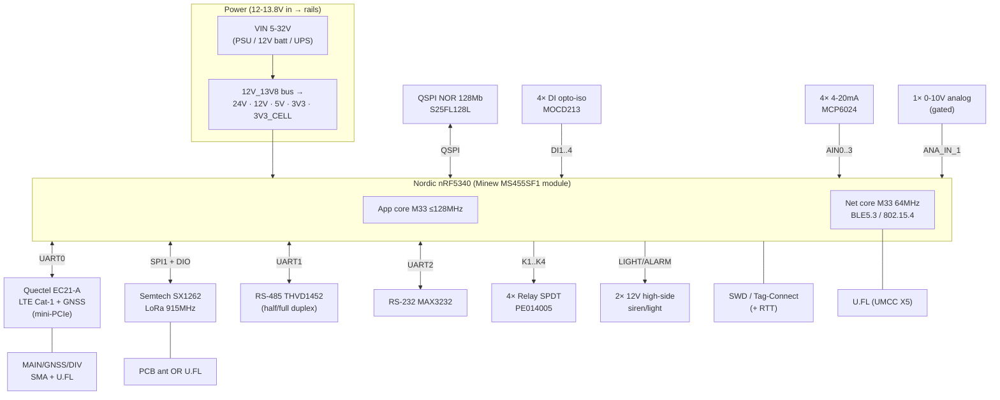
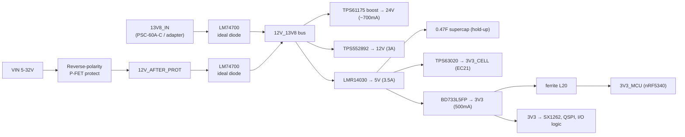
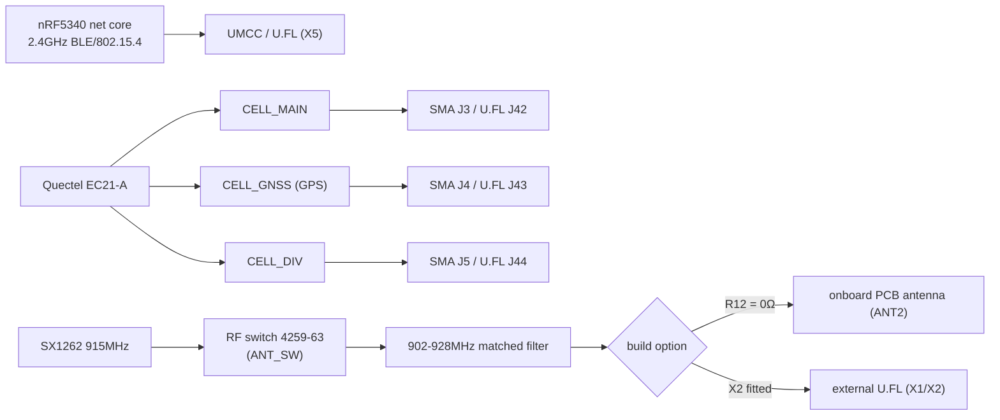

# VX-0057 "RTU BOARD" — hardware reference (`main-board`)

> What this board **is and is not**, for testers and for Claude. This is the
> foundation the firmware/software/use-case work rests on.

| | |
|---|---|
| **Board** | VX-0057 — "RTU BOARD" (the RTU-v2 upgrade), universal cellular/LoRaWAN I/O board |
| **Repo** | https://github.com/Viaanix/VX-0057.git (`main`), READ-ONLY |
| **Reviewed commit** | `f106f8cbffe39f5ceb62bdccfa83e5018f9f86a0` |
| **Schematic revision** | **Rev B**, dated 04/15/2026 (17-sheet PDF: `Project Outputs for VX-0057/VX-0057-B.PDF`) |
| **Reviewed by** | `/understand-hardware`, manual review (hardwaremcp **not** connected) |
| **`project.yaml` role** | the single `hardware:` board; runs all three firmware images (`tank-monitor`, `callbox`, `rtu`) |

> **Method & confidence.** The repo ships **binary Altium CAD** (`.SchDoc/.PcbDoc`)
> plus an **exported schematic PDF** and **text `.Harness` connectivity files** + a
> text **`.BomDoc`**. This review is built from: the 17-page schematic PDF (read
> visually, page by page), the harness net-lists, and the BOM part list. There is
> **no Gerber/netlist export** in the repo, so PCB-layout findings (trace/clearance/
> impedance/stackup) and a manufacturing audit are **out of scope** here — see *Gaps*.

---

## 1. Identity & role
The VX-0057 is a **universal industrial RTU / telemetry I/O board**. One PCB carries:
a **Nordic nRF5340** host (BLE 5.3 / 802.15.4), a **Quectel EC21-A LTE Cat-1**
cellular modem **with GNSS**, and a **Semtech SX1262 LoRa** (US 915 MHz) radio —
so it can report over **cellular and/or LoRaWAN**. The field I/O is the point of the
board: **4 opto-isolated digital inputs, 4× 4-20 mA analog channels, 1× 0-10 V analog
input, 4 relay outputs (SPDT), 2 high-side siren/light outputs, RS-232 and RS-485**.
It is designed to run from **~12-13.8 V** (DC supply / battery / Mean Well UPS) and to
provide **switchable 5/12/24 V "port power"** to field sensors.

The same hardware is flashed with three different firmware images for three product
personalities — **Tank monitor**, **Callbox**, **RTU** — which differ only in which of
these peripherals they exercise (see `USE-CASES.md`).

---

## 2. Compute
- **Module:** **Minew MS455SF1** — "Nordic nRF5340 SoC-based Bluetooth 5.3 LE module"
  (`MODULE_MS45SF1_NRF5340` footprint, U8). RF for the 2.4 GHz radio is brought out to a
  **UMCC / U.FL connector (X5, 50 Ω)** on the board (the module variant here routes to an
  external connector rather than relying solely on a module PCB antenna — confirm per unit).
- **SoC:** **Nordic nRF5340** — dual Arm Cortex-M33:
  - **Application core** — up to **128 MHz**, 1 MB flash, 512 KB RAM (TrustZone, FPU).
  - **Network core** — **64 MHz**, 256 KB flash, 64 KB RAM — runs the BLE 5.3 /
    802.15.4 radio stack (Nordic dual-core split).
- **Clocks:** external **32 MHz** crystal present (`Y_32MHz…CX2016DB32000`, HFXO reference).
  **No 32.768 kHz crystal** was found in the BOM — LFCLK is presumably the internal RC
  oscillator or supplied inside the module (see *Flagged items*; matters for low-power
  timing / RTC drift).
- **Reset supervisor:** **MCP121T-240E** (U7) — drives **NRST** (open-drain, ~2.40 V
  threshold) on the 3V3_MCU rail.
- **USB:** the module's **D+/D-** (pins 12/13) are routed on the board (nRF5340 has a
  USB device controller) — endpoint/use TBD (possible debug/DFU; verify).

---

## 3. Power architecture
Input is a wide **5-32 V** range (silk: "Input Voltage Range 5v-32v"), in practice
**~12-13.8 V** from a DC supply, a 12 V battery, or a **Mean Well PSC-60A-C** 13.8 V
UPS/charger (M1, external; provides DC + battery charging + `AC_OK`/`BATT_LOW` signals).

**Front end:** reverse-polarity **P-FET protection** → output `12V_AFTER_PROT`. Two
sources (`13V8_IN` from the UPS/adapter, and `12V_AFTER_PROT` from the battery path) are
**OR'd by two TI LM74700 ideal-diode controllers** (+ N-FET DMT6007) onto a common
**`12V_13V8`** bus — automatic, glitch-free failover between adapter and battery. TVS
(SMBJ33CA) on each source. The board also takes an **external 12 V battery** on **J36**
(fuse F2 = 2.5 A, TVS D31 SMBJ30CA, test points TP7/TP8).

From the `12V_13V8` bus:

| Rail | Regulator | Type | Output | Feeds |
|---|---|---|---|---|
| **24V** | TPS61175 (U13) | boost | ~24 V, ≤~700 mA | 4-20 mA loop power, DI/analog port power |
| **12V** | TPS552892 | buck-boost | 12 V, **≤3 A** | relays (via 5V), siren/light, port power; turn-on ≈8.0 V |
| **5V** | LMR14030 | buck | 5 V, **≤3.5 A** | 5V_RELAY, port power, supercap, downstream 3V3 |
| **3V3_CELL** | TPS63020 | buck-boost | 3.3 V (cell) | Quectel EC21 (`3V3_C`, ferrite-filtered) |
| **3V3** | BD733L5FP (LDO) | LDO | 3.3 V, **≤500 mA** | nRF5340, SX1262 LoRa, QSPI flash, logic, I/O front-ends |

- **`3V3_MCU`** is the nRF5340 supply, derived from `3V3` through a **ferrite bead
  (L20, 30 Ω/1.8 A)** + bulk/decoupling — most subsystems get their own ferrite-isolated
  3V3 tap (`3V3_DI`, `3V3_4_20mA`, `3V3_RS_232`, `3V3_RS_485`, etc.).
- **Hold-up:** a **0.47 F supercap** (FT0H474ZF) sits on the **5 V** rail through a diode
  (D27) — energy reservoir to ride out cellular-TX current bursts / brief power loss.
- **Rail-presence monitoring:** `13V8_MONI`, `12V_13V8_MONI`, `12V_AFTER_PROT_MONI` are
  generated by MOSFET inverters and fed to the SoC. ⚠️ The schematic note states these are
  **"Input to SoC in negative logic"** — they are **digital present/absent flags
  (active-low), not analog voltage readings** (a separate non-inverting section drives the
  indicator LEDs). `AC_OK` and `BATT_LOW` are digital inputs with 10 kΩ pull-ups to 3V3_MCU.

**Bench power (this bench: `jlink:true`, `ppk2:false`, `serial:false`):** drive the board
from a **12 V (12-13.8 V) supply** into the **external 12 V battery input (J36)** — the
12 V buck-boost won't start below ~8 V. **No current measurement is possible on this
bench** (no PPK2); rail capacities above are design limits, not measured consumption.
Per-mode current envelopes (sleep / idle / cellular-TX) are **to be measured** if/when a
PPK2 is added.

---

## 4. Debug & programming
- **SWD only** (nRF5340): signals **SWDIO / SWCLK / NRST**.
- **Two access points:** (a) a **Tag-Connect** footprint (`TAG_X`, pads, no connector),
  and (b) a **populated SWD header** (with 3V3_MCU sense). Either works with the
  **J-Link** on this bench.
- **Observation = RTT over J-Link** (and BLE if exercised). There is **no dedicated UART
  debug console** broken out — all three UARTs are committed to peripherals
  (cellular/RS-485/RS-232). With `serial:false` on this bench, **RTT is the primary log/observe path** for `/run-test`.
- Programming a dual-core nRF5340 means **two images** (application + network core); recovery/unlock via `nrfutil device` / J-Link if APPROTECT is set.

---

## 5. Peripherals

### Radios
| Radio | Part | Interface to nRF5340 | Band / notes |
|---|---|---|---|
| **Cellular** | Quectel **EC21-A** (mini-PCIe card in socket **X4**) | **UART0** (AT) + control: `CELL_EN`, W_DISABLE#, PERST#, DTR, RI; USB D±/PCM available | LTE Cat-1, **North America bands**; **GNSS (GPS)** built in; SIM socket (SF72S006) |
| **LoRa** | Semtech **SX1262** (U3) | **SPI1** (CLK/MISO/MOSI/`LoRa_CS`) + `LoRa_BUSY`, `LoRa_RST`, `DIO1`, `DIO3`, `ANT_SW` | **915 MHz US** (902-928 MHz matched filter); 32 MHz xtal Y1; RF switch 4259-63 |
| **BLE / 802.15.4** | nRF5340 network core | internal | 2.4 GHz → **UMCC/U.FL (X5)** |

### Memory
- **QSPI NOR flash, S25FL128L (128 Mbit / 16 MB)** — on the nRF5340 **QSPI** bus
  (`QSPI_SCK`, `FLASH_CSN`, `QSPI_IO0..3`), each line with a 22 Ω series resistor.
  External storage for firmware assets / data logging.

### Field I/O (the "universal I/O" set)
| Function | Qty | Part / front-end | Signals → nRF5340 | Notes |
|---|---|---|---|---|
| **Digital inputs** | 4 | **MOCD213** dual optocouplers (isolated) | `DI1..DI4` | Per-channel **excitation 3V3/5/12/24 V** rails; jumper (JMP8/10/12/14) selects **common vs isolated ground** ("1-2: common; open: isolated") |
| **4-20 mA inputs** | 4 | **MCP6024** quad op-amp; precision 15 K 0.1 % + 237 Ω + 4.7 Ω sense; P6SMB20CA TVS + BAV199 clamp; 600 Ω ferrite | `AIN0..AIN3` (ADC) | Each channel provides **selectable 12 V/24 V loop power** out (J6-J9 + JMP3-6) for 2-wire transmitters |
| **Analog voltage input** | 1 | gated divider (Q10 BSS138L / Q11 P-FET, 100 k network) | `ANA_IN_1_SAMPLE` (ADC), `ANA_IN_1_EN` (enable) | **0-10 V range**; sampling is **gated by `ANA_IN_1_EN`** (input only draws current when enabled — power saving). Port power 5/12/24 V selectable (J41/J48) |
| **Relay outputs** | 4 | **PE014005 SPDT relay**, **5 V coil** (5V_RELAY), N-FET driver (DMN2005K), flyback diode, status LED | `K1_TRIG..K4_TRIG` | Field terminals **COM/NO/NC** per relay (WAGO). Contact rating per PE014005 datasheet (**confirm**) |
| **Siren / Light** | 2 | **P-FET high-side** (~2.6 A), pull/level network | `LIGHT`, `ALARM` | Two **switched 12 V outputs** (`12V_SIREN`) for a warning light + siren/horn |
| **RS-485** | 1 | **THVD1452** (U2) + CDSOT23-SM712 ESD | **UART1** + `DIR1`, `DIR2` | **Half- OR full-duplex** (config jumpers R5/R6/R7): full = A/B in + Y/Z out, both DIRs; half = jumper A-Y, B-Z, RE-DE. 10 k bias, 22 Ω series. Port power 5/12 V (JMP2) |
| **RS-232** | 1 | **MAX3232** (U1) | **UART2** | Standard TX/RX. Port power 5/12 V (JMP1) |

**UART map (important for firmware):** `UART0 → cellular (EC21)`, `UART1 → RS-485`,
`UART2 → RS-232`. **SPI1 → LoRa.** **QSPI → flash.**

---

## 6. Connectors & test points
| Ref | Type | Purpose | Test relevance |
|---|---|---|---|
| **J22** | JST B6P-VH | **AC mains line** to PSC-60A-C (AC_N/AC_L) | ⚠️ **MAINS** — do not energize on bench |
| **CN2 (to PSC-60A-C)** | header | battery + DC + AC_OK + BATT_LOW exchange with UPS | UPS signalling |
| **J29** | Adam 2604-3102 | **AC input to board** | ⚠️ **MAINS** |
| **J36** | Adam 2604-3102 | **External 12 V battery input** (`12V_EXT_BATT`, fuse F2 2.5 A, TVS D31) | **Primary bench power entry (12 V)**; TP7/TP8 probe points |
| ext-batt input | Adam 2604-3102 | external battery → PSC-60A-C (fuse + SMBJ30CA) | |
| **SWD header / TAG_X** | header + Tag-Connect | SWDIO/SWCLK/NRST (+3V3_MCU) | **J-Link attach / RTT** |
| **J11/J13/J15/J17** | PH1-04-UA + JMP8/10/12/14 | Digital inputs DI1-4 (+ GND common/iso) | stimulate DI |
| **J6/J7/J8/J9** | 68001-203HLF 3-pos + JMP3-6 | 4-20 mA channels 1-4 (IN + loop power 12/24 V) | inject loop current; measure AINx |
| **J41 / J48** | 68001-203HLF 3-pos + JMP16/17 | 0-10 V analog input + port power select | apply 0-10 V; read ANA_IN_1 |
| Relay terminals | WAGO 2734 (3/4/6 pos) | K1-4 COM/NO/NC (`RELAY_OUT`) | check continuity NO/NC on trigger |
| RS-485 / RS-232 terminals | WAGO + J1/J2 | A/B(/Y/Z), TX/RX (+ port power) | loopback / bus traffic |
| Siren/Light terminals | WAGO | ALARM, LIGHT (12 V switched) | measure output switching |
| **J3/J4/J5** | SMA (142-0711-201) | Cellular **MAIN / GNSS / DIV** | attach antennas |
| **J42/J43/J44** | U.FL (1909763-1) | Cellular **MAIN / GNSS / DIV** (alt to SMA) | antenna option |
| **X1/X2 / ANT2** | U.FL / PCB antenna | **LoRa** antenna (build option) | attach/verify antenna |
| **X5 (UMCC)** | U.FL | nRF5340 **2.4 GHz BLE/802.15.4** | attach antenna to exercise BLE |
| SIM socket | SF72S006 | micro-SIM for EC21 | insert activated SIM for cellular |
| TP4/TP6/TP7/TP8 | test points | power/battery monitoring | scope/DMM rail checks |

---

## 7. RF & antennas
Three independent radios, each with its own antenna path:

- **Cellular:** MAIN + DIV (LTE diversity) + **GNSS** — each available as **SMA or U.FL**
  (only one footprint populated per port per build).
- **LoRa (US 915 MHz):** mutually-exclusive **build option** — **R12 (0 Ω) = onboard PCB
  antenna**, **X2 (U.FL) = external antenna**. Schematic note: *"X2 fitted: external antenna
  enabled / R12 connected: pcb antenna enabled."* **Verify which is populated on the DUT
  before any LoRa RF test.**
- **BLE/802.15.4:** needs an antenna on **X5 (U.FL)** to be exercised.

---

## 8. Cannot / not populated / constraints
- **No PCB-layout / Gerber / netlist export** in the repo → impedance, stackup, trace/
  clearance, and a manufacturing audit are **not reviewable here** (binary `.PcbDoc` only).
- **Antenna build options** (LoRa PCB-vs-U.FL; cellular SMA-vs-U.FL) mean **a given unit
  populates only one path per radio** — not a defect, but test setup must match the build.
- **Mains present** (J22/J29, PSC-60A-C path): **do not energize AC on the bench.** Power
  the DUT from low-voltage DC (12 V at J36) only.
- **This bench:** `jlink:true`, **`ppk2:false`** (no current/power measurement),
  **`serial:false`** (no UART console wired → use **RTT**).
- **No 32.768 kHz crystal** in BOM (LFCLK source to confirm — affects low-power RTC).
- Several SoC GPIOs are **multiplexed with special functions** — see *Flagged items*
  (notably **NFC pins used as relay drivers**).

---

## 9. Bench / test hooks (what a test can stimulate & measure)
- **Flash/observe:** J-Link via SWD header or Tag-Connect; **RTT** for logs; load app +
  network core images.
- **Digital inputs:** drive DI1-4 at J11/J13/J15/J17 (set excitation rail + ground jumper).
- **4-20 mA:** inject a known loop current at J6-J9, read back `AIN0..3` via firmware/RTT;
  optionally use the channel's 12/24 V loop supply.
- **0-10 V analog:** apply a voltage at J41/J48; firmware asserts `ANA_IN_1_EN` then reads
  `ANA_IN_1_SAMPLE`.
- **Relays:** trigger K1-4, verify COM↔NO / COM↔NC continuity at the WAGO terminals
  (watch the NFC-pin caveat for K3/K4).
- **Siren/Light:** assert LIGHT/ALARM, measure 12 V switching at the outputs.
- **RS-232 / RS-485:** loopback or bus master/slave; RS-485 supports half/full duplex.
- **Cellular:** insert activated SIM, attach MAIN (+GNSS) antenna, observe AT/registration
  over UART0 and check-in to VX Olympus (ThingsBoard).
- **LoRa:** attach the populated antenna, exercise SX1262 join/uplink.
- **Rail checks:** DMM/scope on TP4/6/7/8 and rail nets (24/12/5/3V3).

---

## 10. Flagged items / things to verify
> Candidate **hardware-repo** items from this review. None are confirmed defects yet —
> several are "verify on the DUT" or firmware-configuration notes. Ask before filing GitHub
> issues (see `/triage`).

1. **Relays K3 & K4 are on NFC pins.** `K3_TRIG`/`K4_TRIG` route to **P0.02/NFC1** and
   **P0.03/NFC2**. On the nRF5340 these are NFC antenna pins by default — firmware **must
   set `UICR.NFCPINS = GPIO`** (e.g. `CONFIG_NFCT_PINS_AS_GPIO`) or **relays 3 & 4 will not
   switch**. *Firmware-config dependency to confirm during `/understand-firmware`.*
2. **No 32.768 kHz LF crystal** in the BOM — confirm the nRF5340 LFCLK source (module-
   internal vs internal RC). Affects low-power timing / RTC accuracy for sleepy telemetry.
3. **Antenna build options** — confirm, per DUT, whether **LoRa** uses PCB (R12) or U.FL
   (X2), and whether **cellular** ports are SMA or U.FL populated. RF tests depend on it.
4. **Rail-presence monitors are digital, active-low** ("negative logic"), not analog —
   make sure firmware reads them as logic flags, not ADC voltages.
5. **USB D+/D-** from the module are routed — confirm intended use (DFU/debug?) or DNP.
6. **Relay contact rating** (PE014005) and **siren/light P-FET current** (FQD7P20TM) —
   confirm against the loads the use-cases drive.

---

## 11. Sources & gaps
**Sources (all under `.refs/main-board/` @ `f106f8c`):**
- `Project Outputs for VX-0057/VX-0057-B.PDF` — 17-sheet schematic, Rev B (read page-by-page):
  Top, MCU, Cellular, LoRa, Power, Flash, Digital_Input, 4-20mA (+4 channel sheets), Relays,
  RS-232, RS-485, Analog_Input, Siren_Light.
- `*.Harness` — net/connectivity between subsystems (MCU↔CELL/DI/LoRa/Memory/Relays/RS-232/
  RS-485, power signals, Tag-Connect, ADC, siren, Vin monitor).
- `VX-0057.BomDoc` — Altium LiveBOM (part identities, MPNs, manufacturers).
- `README.md` — "upgrade of the RTU board"; `VX-0057-B.png` board render.

**Gaps / unverified:**
- **PCB layout** (Gerbers/drill/stackup/impedance) and **manufacturing audit** — not in repo.
- Exact **nRF5340 GPIO numbers** for a few low-traffic signals (LIGHT/ALARM, some monitors)
  read from a dense PDF — functional mapping is solid; treat individual pin numbers as
  "verify against firmware pinctrl."
- **Measured currents** per mode — none (no PPK2 on this bench).
- **Component values** on a few I/O sheets were read from extracted text rather than a clean
  table; ratings flagged "confirm" above should be checked against datasheets.
- `MS455SF1` module **vendor = Minew** (from BOM); detailed module pinout/antenna variant not
  independently datasheet-verified.
