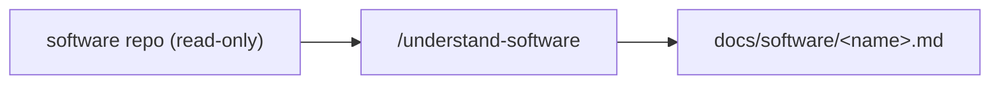

# Software docs

> One `*.md` per software repo listed in `project.yaml` (`software:` — cloud/backend/app/API/dashboards),
> **generated by `/understand-software`** (full-depth, read-only review). These are Claude's reference for the
> telemetry/data model and the interfaces a test can drive to verify end-to-end behaviour (e.g. cloud check-in).
> The software repos are **read-only** — reviewed in place, never modified.

No reviews have run yet (and a product may have no software side). Run `/understand-software` to populate this folder.
