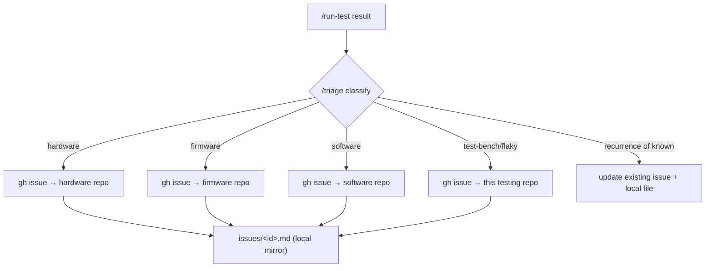

# Issues — local mirror

> Maintained by `/triage` (and `/run-test`). Every finding is recorded here as one Markdown file
> **and** filed as a GitHub issue **on the repo it belongs to** (hardware defect → that hardware repo,
> firmware defect → that firmware repo, harness/test problem → this testing repo). The local file is
> the durable, diffable record and links back to the GitHub issue + the run that produced it.



## File format — `issues/<id>.md`
`<id>` is a **stable signature** so re-runs update the same issue instead of filing duplicates:
`<use-case>-<check>-<fingerprint>`. The **fingerprint is the failure CLASS** (`over-ceiling`,
`under-floor`, `over-current`, `timeout`, `signature-not-seen`, `flash-failed`, …) — **never** the
measured value, run id, or timestamp (those go in Evidence). So the same defect collapses to one
issue across runs. See the `/triage` skill for the rule + worked examples.

Dedup keys on the `signature:` frontmatter field (the pipe-delimited `<use-case>|<check>|<fingerprint>`),
**not** the filename — the `<id>` filename is just a human-readable label, and since use-case slugs may
contain hyphens, don't try to parse segments out of it.

```markdown
---
id: <use-case>-<check>-<fp>
title: <one line>
severity: blocker | major | minor
category: hardware | firmware | software | test-bench | flaky
route_repo: https://github.com/Viaanix/<repo>.git   # where the GitHub issue was filed
github: "#123"            # or "unfiled (no gh perms)"
signature: <use-case>|<check>|<failure-fingerprint>
status: open | closed
first_seen_run: <run-id>
last_seen_run: <run-id>
seen_runs: [<run-id>, ...]
---

## Summary
What failed, in one paragraph.

## Expected vs actual
- Expected: …
- Actual: …

## Evidence
- run: `results/<run-id>/` (serial log, power profile, summary)
- relevant signature lines / measurements

## Repro
Run `tests/<use-case>/` per its `plan.md` (or `/run-test` for that use case).

## Suspected area
Link into docs/firmware/<name>.md or docs/hardware/<name>.md.
```

No issues yet.
