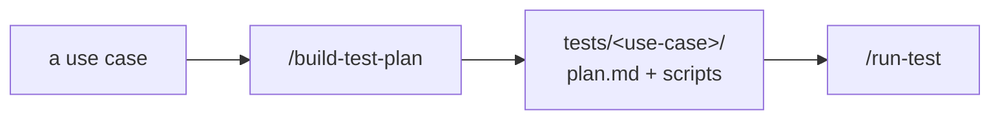

# Tests

> Bespoke test plans live here — **one directory per use case** (`tests/<use-case>/`),
> built by `/build-test-plan` from `USE-CASES.md` + `docs/hardware|firmware|software/*`.
> There's no shared framework: each plan is whatever code/steps actually validate that
> use case on this board (flash with nrfjprog/J-Link, read serial/RTT, measure with the
> PPK2, check the cloud, etc.).

Each `tests/<use-case>/` should contain a short `plan.md` (what it checks, the exact
signals/measurements, and pass/fail criteria — with a Mermaid diagram) plus whatever
scripts run it. `/run-test` executes a plan and writes results to `results/`.

No plans yet. Run `/build-test-plan` after the understand-skills + `/define-use-cases`.
