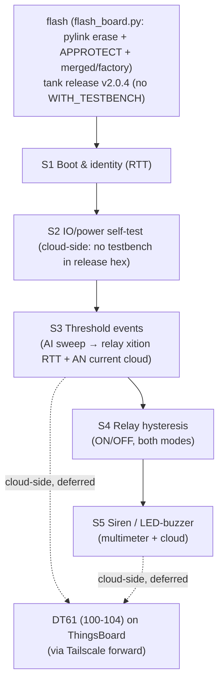

# Test plan — Tank Monitor (VX-0057, `tank-monitor` image)

> **CORRECTION (2026-07-07, from GitHub issues + live cloud — see
> [docs/PROJECT-UNDERSTANDING-from-issues.md](../../docs/PROJECT-UNDERSTANDING-from-issues.md)):**
> **DT113 IS real** (an earlier note wrongly denied it — reversed after live RTT 2026-07-07):
> the firmware logs **`DT113`** for tank-level/threshold events (`tank_number`, `threshold_level`,
> `current_value_ua`, per the QA test spec) AND **`DATA_TYPE_61`** for the check-in — both seen on
> RTT (`vx_app: DT113`, `vx_app: DATA_TYPE_61`). Cloud also exposes decoded `tankNumber` /
> `thresholdLevelType` / analog value + derives level/percent from `analogInputNcurrent`.
> Thresholds are read **live from the cloud** each run (`thresholds.py`) — post-reflash the device
> reset to factory defaults **HH20000/H15000/L5000/LL2000 uA, relay on20000/off15000** (all
> channels), which differ from earlier readings; never trust a hardcoded band. Bench PSU limit **1.5 A**;
> supercaps cause a **30-40 s delayed cold start** (don't grade boot too early).

> Bespoke plan for the **tank-monitor** use case ([USE-CASES.md](../../USE-CASES.md#part-b--tank-monitor-tank-monitor-build-type-0)).
> Grounded in [hardware](../../docs/hardware/main-board.md) + [firmware](../../docs/firmware/tank-monitor.md)
> ([common](../../docs/firmware/vx_ioboard_fw-common.md)) docs and `.claude/memory/`, and in the
> engineer's **Tank Monitor RTU** product/test spec (Tests 1-5, Siren scenarios 6-8, LED/buzzer logic).
> Source repos are READ-ONLY; this plan never modifies firmware/hardware.

## What this validates
The `tank-monitor` image turns 4× 4-20 mA tank-level inputs into **threshold events**, **relay
control**, **siren/light**, and **cloud uplink**. Per the product spec: AI _n_ → Relay _n_;
per-tank HH/H/L/LL thresholds; relay ON/OFF hysteresis; siren ON/OFF thresholds; a global LED/buzzer.

## ⚠️ Grounding facts that shape this plan (read before running)
1. **Most tank "events" are NOT plain RTT strings.** `TANK_LEVEL_HIGH_HIGH/HIGH/NORMAL/LOW/LOW_LOW`,
   `SIREN_*`, `OUTPUT_*`, power events are queued as **DT61** records and the threshold record as
   **DT113** straight into the uplink (`VxApp_SendEvent`/`VxApp_SendThresholdEvent`,
   `vx_app.c:296-332`) — **no readable log line is printed**. They are observable **cloud-side**
   (decode the uplink `ph` hex), which is **deferred** until the AWS→Tailscale→ThingsBoard path is
   built (`/understand-software`).
2. **What IS auto-observable on RTT (INFO):** relay/output **state transitions** —
   `Channel: %u, state transition: <state> --> <state>` (`vx_app_tank.c:680-688`,
   `set_state_dig_out`, log instance per channel). The self-test analog reads `AN%d: … (%d uA)`.
3. **Siren transitions log at DBG only** (`set_state_siren`, `vx_app_tank.c:659`) → not on RTT at
   default INFO. **Siren is verified with a multimeter (12 V ON / 0 V OFF)** — exactly as the spec says.
4. **Default thresholds (compile-time, used until cloud config is pushed)** — fresh chip-erased board:
   - **Level profile:** HH = **10.0 mA**, H = **9.0 mA**, L = **8.0 mA**, LL = **7.0 mA** (`vx_app_tank.c:52-57`).
   - **Relay (dig-out) hysteresis:** ON = **5.0 mA**, OFF = **10.0 mA** (`vx_app_tank.c:46-47`).
   - **Siren:** ON = **5.0 mA**, OFF = **10.0 mA** (`vx_app_tank.c:41`).
   The engineer's example thresholds (HH 19.5 / H 17 / L 8 / LL 5 mA, etc.) require **cloud
   configuration** (DT71/settings), which isn't wired on this bench yet — so bench test vectors use
   the **firmware defaults above**, and threshold-value tests against the spec examples are deferred
   to when cloud settings can be pushed. (4-20 mA → µA scale uses factor 157.3, `io_handler.c`.)



## Prerequisites
- **Image:** the **release v2.0.4 dev** tank-monitor merged + factory hex ARE on disk and wired in
  `config.py:14-19` (`TANK_IMAGE`/`FACTORY_DATA_IMAGE`). This is the **release** app — built **without**
  `WITH_TESTBENCH`, so the `***IO BOARD TEST...***` self-test brackets do NOT print; **S2 power/analog is
  verified cloud-side** (ThingsBoard telemetry), not over RTT. (To get the RTT self-test you'd build a
  `WITH_APPLICATION_IO_BOARD_TYPE=0` + `WITH_TESTBENCH=y` image and point `TANK_IMAGE` at it.)
- **Flash:** the runner uses `flash_board.py` — a headless **pylink** recipe (`nrfjprog --recover` unlock
  → `jlink.erase()` full mass-erase → settings@0xFC000 → **write APPROTECT/SECUREAPPROTECT** to keep RTT
  open → `flash_file(merged)` + `flash_file(factory)` → reset), **not** `nrfjprog --chiperase`. The mass
  erase clears UICR and `flash_file(merged.hex)` rewrites it, so UICR `NFCPINS=GPIO` is restored **iff the
  merged hex carries it** — confirm relays **K3/K4** actuate after flash; if dead, the hex lacks the NFCPINS
  UICR word ([[nrf5340-nfc-relay-pins]]). (`tankmon.flash_chiperase` is the older nrfjprog path, now unused.)
- **Observe:** `pylink` RTT over J-Link (needs SEGGER J-Link software/DLL installed). No UART console.
- **Power:** 12 V into J36. **Detach/disable the watchdog before halting at a breakpoint** (120 s WDT
  resets the board under the debugger).
- **Field-IO stimulus (S3-S5) — current rig:** a **Riiai DC 0-10V 0/4-20mA signal generator**
  (Amazon B099DZVG9F). It is **manual + single-channel** (knob/fine + 9 presets; micro-USB is
  power-only, **no PC control**), so: the operator sets the current by hand on **one AI at a time**,
  and the runner auto-captures + auto-judges the RTT response (the prompted flow in `run.py`).
  Implications: (a) injection is **manual, not automated**; (b) the global LED/buzzer "all 4 tanks"
  logic can't be driven (needs 4 sources). **Output sensing** (relay contact / siren V) is **not**
  provided by this device — use a **multimeter** (manual) and/or the firmware's RTT relay-transition +
  DT90 bit. *Future robust path:* a PC-controllable source (e.g. Yoctopuce Yocto-4-20mA-Tx, or a USB
  DAQ analog-out + V→I) + a USB DAQ/relay-readback → fully unattended sweeps and auto output checks.
- **Cloud (event verification):** **deferred** — needs the AWS→ThingsBoard/Tailscale forward.

## Scopes (each independently runnable)

### S1 — Boot & identity   · P0 · auto (RTT)
- **Steps:** chip-erase flash the tank image → reset → capture RTT from boot.
- **Observable:** `Firmware title …`, `Firmware version …`, **`Application type io_tank_monitor`**,
  `Compile time …`, then `vx_app: Viaanix APP Init`.
- **Pass:** all version lines present, app-type == `io_tank_monitor`, `Viaanix APP Init` reached, no
  fatal/reboot; ≤ **15 s** ⟶ confirm. **Fail:** wrong app type, missing init, or a reset loop.

### S2 — IO / power self-test   · P0 · auto (RTT), full lines need the rig
- **Steps:** boot a `WITH_TESTBENCH=y` build; capture the bracketed self-test.
- **Observable:** between `***IO BOARD TEST STARTED***` and `***IO BOARD TEST ENDED***`:
  `External Memory: OK`, power-rail lines, `AN%d: … (%d uA)`, (`DI…`, `RS232/RS485 ECHO: OK` if rigged).
- **Pass (bare board):** `External Memory: OK` + power rails reflect the 12 V bench + both brackets
  print. **Pass (with rig):** every `AN`/`DI`/`ECHO` line matches the stimulus. **Fail:** ext-mem
  ERROR, wrong rail, or a rigged channel mismatches. (Un-stimulated `AN/DI/ECHO` = "not stimulated",
  not a fail.)

### S3 — Threshold (level) events   · P1 · relay xition auto (RTT) + DT61/DT113 cloud (deferred)
Maps the spec's **Test 1, Test 2, Test 5**.
- **Steps (per AI 1-4, manual or automated current source):**
  1. Sweep current up through L→NORMAL→H→HH and down through NORMAL→L→LL, pausing in each band.
  2. Operator enters the applied mA at each step (or the automated source reports it).
- **Observable / pass:**
  - **Auto (RTT now):** the mapped relay's `Channel: n, state transition` fires at the configured
    band edges (see S4 for the relay thresholds). The self-test/`AN%d … uA` reflects the injected
    current within **±2 % / ±0.1 mA** ⟶ confirm.
  - **Cloud (deferred):** `DT113` records appear with `tank_number = AI+1`, `threshold_level` =
    HH/H/NORMAL/L/LL, `current_value_ua` ≈ injected; events `TANK_LEVEL_*` fire **once per condition**
    (no repeats until cleared & re-entered); **`TANK_LEVEL_NORMAL`** when back between L and H.
  - **Test 5 (disabled, Min=Max=0):** with thresholds zeroed (cloud), no DO3/DO4 toggle and **no**
    level events — verifiable only once cloud config + cloud-read are available.
- **Note:** "report immediately, no app-check-in wait" — events are priority/event-triggered uplinks.
- **Default-threshold vectors (bench, no cloud):** crossing **9 mA** → H, **10 mA** → HH, **8 mA** → L,
  **7 mA** → LL, between 8-9 mA → NORMAL.

### S4 — Relay output hysteresis   · P1 · auto (RTT) + continuity
Maps the spec's **Test 3 (ON>OFF)** and **Test 4 (ON<OFF)**.
- **Steps:** drive the AI across the relay ON/OFF thresholds in both directions; read the relay
  (continuity COM↔NO) and RTT.
- **Observable:** RTT `Channel: n, state transition: … --> ON/OFF`; continuity toggles; DT90
  `dig_out_n` bit (cloud).
- **Pass:**
  - **ON>OFF mode:** relay turns **ON above ON-threshold**, stays ON until **below OFF-threshold**.
  - **ON<OFF mode:** relay turns **ON below ON-threshold**, stays ON until **above OFF-threshold**.
  - No chatter within the hysteresis band. **K3/K4 (relays 3-4) must actuate** (chip-erase gate).
  - Bench defaults: ON = 5 mA, OFF = 10 mA (ON<OFF mode) unless cloud-reconfigured.
- **Fail:** relay doesn't toggle at the edge, chatters, or K3/K4 dead (UICR not erased).

### S5 — Siren / light + LED-buzzer   · P2 · multimeter (manual) + cloud (deferred)
Maps the spec's **Siren scenarios 6, 7, 8** and the global **LED/buzzer** logic.
- **Steps:** set siren ON/OFF thresholds (cloud) or use defaults; sweep the AI; **measure the siren
  output with a multimeter**; toggle Siren-Mode button/setting; test individual-disable (ON=0, OFF=0).
- **Observable / pass:**
  - **Multimeter:** **12 V at the siren output when ON, 0 V when OFF**.
  - Siren-mode **ON** → siren follows thresholds; **OFF/disabled** → siren stays 0 V and only normal
    level behavior occurs; disabling while ON → siren **auto-OFFs** after the settings apply.
  - Individual disable (ON=0 & OFF=0) → that output stays **0 V** regardless of AI.
  - **Global LED/buzzer:** ON if **any** tank exceeds its `buzzerOnThreshold`; OFF only when **all**
    tanks are below their `buzzerOffThreshold`.
  - **Cloud (deferred):** `SIREN_ON`/`SIREN_OFF` (DT61) recorded.
- **Caveat:** siren state is **not on RTT at INFO** — multimeter is the bench signal of record.
  Siren-mode and per-output enable/disable need **cloud settings**, so the full S5 matrix is gated on
  the cloud-config path; the multimeter ON/OFF check against default thresholds is doable now.

## Pass/fail & artifacts
Each scope writes `results/<run-id>/tank-monitor/<scope>.json` (+ a `summary.md`) with: the captured
RTT, the parsed signals, per-criterion pass/fail, and `overall`. Auto scopes (S1, S2, S4-relay) judge
from RTT; manual steps (S3 current entry, S5 multimeter) prompt the operator and record the entered
values. Cloud-side assertions are emitted as `deferred` (not pass/fail) until the forward exists.

## How to run
```
# from tests/tank-monitor/  (set TANK_IMAGE=path\to\tank_merged.hex first)
python run.py boot            # S1
python run.py selftest        # S2  (build with WITH_TESTBENCH=y)
python run.py thresholds      # S3  (prompts for injected mA per AI)
python run.py relay           # S4  (prompts; reads relay xition from RTT)
python run.py siren           # S5  (prompts for multimeter readings)
python run.py all             # S1→S5 in order
python run.py --capture-only 30   # just dump 30 s of RTT (debug)
python test_parse.py          # offline: validate parsers against fixtures (no hardware)
```
Or the repo verb: **`/test-tank`**.

## Caveats / false-fail traps (from `.claude/memory/` + grounding)
- **Chip-erase every flash** or K3/K4 relays are dead (NFC pins) — not a firmware bug.
- **Build type 0** (default build is turnstile) and **`WITH_TESTBENCH=y`** for S2.
- **RTT, not serial.** SEGGER J-Link software required for `pylink` RTT.
- **Watchdog resets the board if you halt at a breakpoint** (120 s, runs under debugger).
- **Tank events/DT113/siren are not INFO RTT strings** — don't fail S3/S5 for "missing log lines";
  use relay transitions (RTT), multimeter (siren), and cloud decode (deferred).
- **Thresholds are firmware defaults** until cloud config is available — spec example values (19.5/17…)
  won't apply on a bare bench board.
- **No PPK2** → no current/power measurement (sleep-current out of scope).

## Open items (carry to `/build-dashboard` / cloud)
1. **Cloud event verification** (DT61/DT113/SIREN, Test 5, full S5 matrix) — needs AWS→Tailscale→ThingsBoard.
2. **Cloud settings push** (per-tank HH/H/L/LL, relay/siren/buzzer thresholds, siren-mode) — needed to
   test the spec's configured thresholds rather than firmware defaults.
3. **Field-IO rig** — current rig is the **manual single-channel Riiai source** (B099DZVG9F);
   injection is operator-driven. Upgrade to a **PC-controllable source** (USB 4-20 mA Tx / DAQ) for
   hands-off input sweeps, and add a **USB DAQ or relay→DI loopback** for automated output sensing.
4. **Thresholds to ratify:** AI accuracy ±2 %/±0.1 mA; boot ≤15 s.
